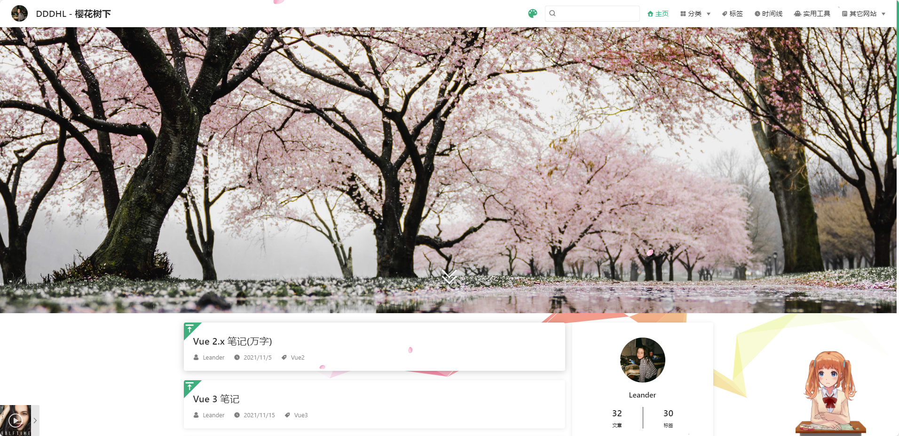

# VuePress

一个 VuePress 搭建的静态博客网站。

预览地址：

`注意：现已停止使用，请查看新仓库` [blog](https://github.com/lee-holden/blog)



## 简介

主题：

- vuepress-theme-reco

插件：

- vuepress-plugin-bgm-player
- vuepress-plugin-auto-sidebar
- vuepress-plugin-cursor-effects
- vuepress-plugin-dynamic-title
- vuepress-plugin-meting
- vuepress-plugin-nuggets-style-copy
- vuepress-plugin-ribbon-animation
- vuepress-plugin-sakura

效果：

## 使用说明

nodejs <= 16

```
npm install
```

```
npm run dev
```

```
npm run build
```
