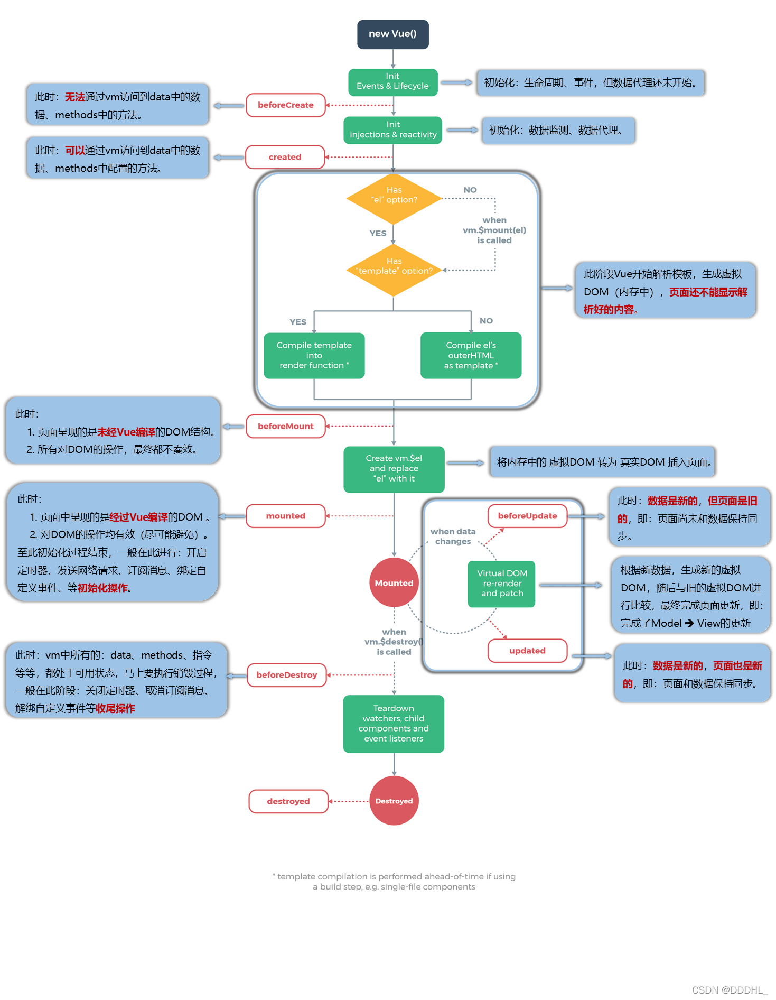
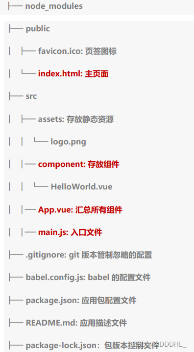
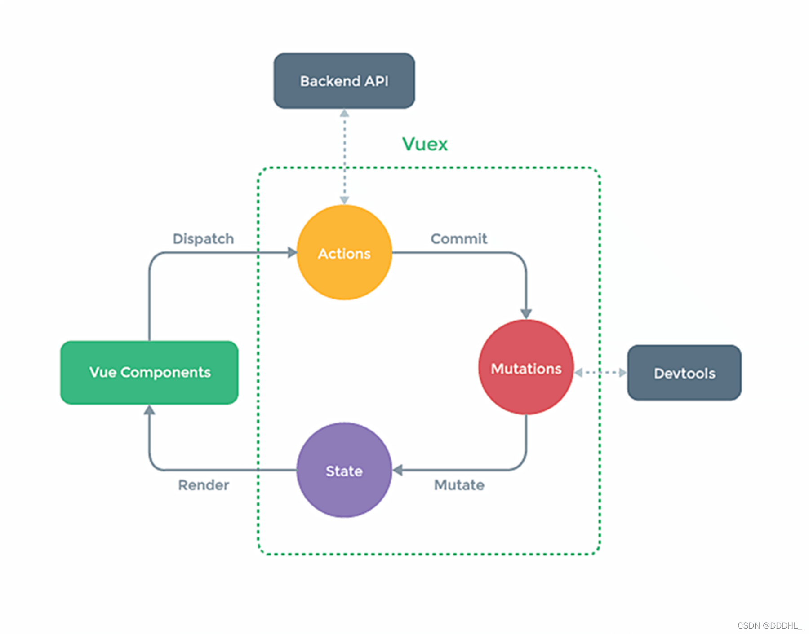

## 1.新建 Vue 实例

```javascript
// 示例1
new Vue({
  el: '#test', // element vue的模板
  // data的第一种写法，对象式
  data: {
    name: 'lhd',
    test: {
      id: 1,
      age: 19,
    },
  },
})
```

```javascript
// 示例2
const vm = new Vue({
  // data的第一种写法，对象式
  data: {
    name: 'lhd',
    test: {
      id: 1,
      age: 19,
    },
  },
})
vm.$mount('#test')
```

```javascript
// data的第二种写法，函数式
// 组件必须用函数式
const vm = new Vue({
  data: function () {
    return {
      name: 'lhd',
    }
  },
})
vm.$mount('#test')
```

## 2.阻止生成生产提示

如果使用的是开发版 Vue，Vue 在启动时会生成生产提示

```javascript
// 关闭提示，新建 Vue 实例要在此语句下面
Vue.config.productionTip = false
```

## 3.模板语法

### **3.1 插值语法**

用于标签体内容

语法：{{你要动态变化的数据}}

```javascript
// 示例：创建 Vue 实例，定义数据name
new Vue({
    el:'#root',      // element
    data:{
        name:lhd
    }
})
// 在 div 标签中插值
<div id='root'> {{name}} <div>
```

### **3.2 指令语法**

用于解析标签属性

#### **3.2.1 单向数据绑定**

单向的意思：只能从 data 流向页面（只能通过修改实例中 data 的数据改变标签数据）

语法：v-bind:标签属性

**v-bind:属性** 可以简写成 => **:**

```javascript
// 示例：创建 Vue 实例，定义数据url,在 a 标签中插值
// 使用 v-bind： 绑定后，就会把里面的语句当成表达式解析
<a v-bind:href="url">跳转链接</a>
<a :href="url">跳转链接</a>
```

#### **3.2.2 双向数据绑定**

双向的意思：可以从 data 流向页面，还可以从页面流向 data

语法：v-model:标签属性

**v-model:value** 可以简写成 => **v-model** 。 因为默认收集的是 value 值

注意：v-model 只能应用在表单类元素(输入类元素)上

```javascript
<input type='text' v-model:value="test">
<input type='text' v-model="test">
```

## 4.MVVM 模型

1.M：模型(Model) ：data 中的数据

2.V：视图(View)：模板代码

3.VM：视图模型(ViewModel)：Vue 实例

data 中的所有属性都出现在 vm 身上

vm 上的所有属性及 Vue 原型上所有属性，在 Vue 模板中都可以直接使用

## 5.数据代理

### 5.1 回顾 Object.defineProperty 方法

```javascript
// 示例1
let a = {
    name:lhd
}
// 加入age数据
Object.defineProperty(a,'age',{
    value:18
    enumerable:true       // 让数据可枚举
    writable:true         // 让数据可修改
    configurable:true	  // 让数据可删除
})
console.log(Object.keys(a))     //用数组输出数据
```

```javascript
// 示例2
let number = 18
let a = {
  name: lhd,
}
Object.defineProperty(a, 'age', {
  // 只要读取a的age属性是，get函数(getter)就会被调用
  get() {
    return number
  },
  // 只要有人修改age属性，set函数就会被调用
  set(value) {
    // 把修改的值赋给number
    number = value
  },
})
```

### 5.2 什么是数据代理

通过一个对象代理对另一个对象中属性的操作

```javascript
// 示例
let obj = { x: 100 }
let obj2 = { y: 200 }
Object.defineProperty(obj2, 'x', {
  // 访问 obj2.x 可以输出 obj.x 的值
  get() {
    return obj.x
  },
  // 修改 obj2.x 可以修改 obj.x 的值
  set(value) {
    obj.x = value
  },
})
```

### 5.3 Vue 中的数据代理

通过 vm 对象来代理 data 对象中属性的操作(读/写)

好处：更加方便的操作 data 中的数据

基本原理：

​ 通过 Object.defineProperty() 把 data 对象所有属性添加到 vm 上。

​ 为每一个添加到 vm 上的属性，都指定一个 getter/setter。

​ 在 getter/setter 内部去操作(读/写)data 中对应的属性。

## 6.事件处理

### 6.1 事件的基本使用

语法：v-on:事件

可简写为 => @

事件的回调需要配置在 methods 上，最终会出现在 vm 上

注意：methods 中配置的函数不要用箭头函数，不然 this 就不是 vm 了

```javascript
// 示例1
<div id='root'>
	<button v-on:click="你要执行的东西">1</button>
	<button @click="你要执行的东西">2</button>

// 示例2 传参。假设点击时执行show()函数
	<button @click="show()">3</button>   // 空时默认传事件对象
	<button @click="show(10,$event)">4</button>   // 空时默认传事件对象
</div>
const vm = new Vue({
    el:'#root',
    methods:{
        show(number,event){
            console.log(number)   // 10
            console.log(event)	  // 事件对象
        }
    }
})
```

### 6.2 事件的修饰符

Vue 中的事件修饰符，可以连续写

​ 1.prevent：阻止默认事件（常用）

​ 2.stop：阻止事件冒泡（常用）

​ 3.once：事件只触发一次（常用）

​ 4.capture：使用事件的捕获模式

​ 5.self：只有 event.target 是当前操作的元素时才触发事件

​ 6.passive：事件的默认行为立即执行，无需等待事件回调执行完毕

### 6.3 键盘事件

@keyup 按键按下去抬起来后执行 @keydown 按键按下去就执行

1.Vue 中常用的按键别名：

​ （1）回车 => enter

​ （2）退出 => esc

​ （3）空格 => space

​ （4）换行 => tab (配合@keydown)

​ （5）上下左右 => up、down、left、right

​ （6）删除 => delete (捕获 “删除” 和 “退格” 键)

2.Vue 未提供别名的按键，可以使用键盘原始的 key 值去绑定，但要注意转为 kebab-case(短横线命名)

​ 例如大小写：CapsLock => caps-lock

3.系统修饰键（用法特殊）：ctrl、alt、shift、meta（win 键）

​ （1）配合 keyup 使用：按下修饰键的同时，再按下其他键，随后释放其他键

​ （2）配合 keydown 使用：正常触发

3.也可以使用 keyCode 去指定具体的按键（不推荐）

4.Vue.config.keyCodes.自定义键名 = 键码 定制别名

```javascript
// 示例1 回车输出
<div id="root">
	<input type="text" placeholder="回车就输出" @keyup.enter="show">
</div>
// js
new Vue({
	el:"#root",
    methods:{
        show(e){
            console.log(e.target.value)
        }
    }
})
```

## 7.计算属性

1.定义：要用的属性不存在，要通过已有的属性计算得来

2.原理：底层借助了 Object.defineproperty 方法提供的 getter、setter

3.get 函数什么时候执行？

​ （1）初次读取时会执行一次

​ （2）当依赖的数据发生改变时会被再次调用

4.优势：与 methods 实现相比，内部有缓存机制（复用），效率高

5.备注：

​ （1）计算属性最终会出现在 vm 身上。

​ （2）如果计算属性要被修改，那必须写 set 函数去响应修改。

```javascript
// 示例：修改姓与名字，全名会变
<div id='root'>
	姓：<input tpye='text' v-modle="firstName"><br/><br/>
	名：<input tpye='text' v-modle="lastName"><br/><br/>
    全名：<span>{{fullName}}</span>
</div>
// js
const vm = new Vue({
    el:"#root",
    data:{
        firstName:'张',
        lastName:'三'
    },
    computed:{
        fullName:{
            get(){
                return this.firstName + '-' this.lastName
            },
            // 当vm的值被修改时，修改data值
            set(value){
                const arr = value.split('-')
                this.firstName = arr[0]
                this.lastName = arr[1]
            }
        }
    }
})
// 示例：简写 => 当只需要get方法时，可以简写
computed:{
    fullName(){
        return this.firstName + '-' + this.lastName
    }
}
```

## 8.监视属性

watch:

1.当被监视的属性变化时，回调函数自动执行

2.监视的属性必须存在，才可以监视

3.监视的两种写法：

（1）new Vue 时传入 watch 配置

```javascript
const vm = new Vue({
  el: '#root',
  data: {
    isHot: true,
  },
  watch: {
    isHot: {
      immediate: true, //初始化时让handler调用一次，默认false
      handler(newValue, oldValue) {
        console.log(newValue, oldValue)
      },
    },
  },
})
```

（2）通过 vm.$watch 监视

```javascript
vm.$watch('isHot', {
  immediate: true, //初始化时让handler调用一次，默认false
  handler(newValue, oldValue) {
    console.log(newValue, oldValue)
  },
})
```

4.深度监视

（1）Vue 中的 watch 默认不监测对象内部值的改变(一层)

（2）配置 deep:true 可以监测对象内部值的改变(多层)

备注：

Vue 自身可以监测对象内部值的改变，但 Vue 提供的 watch 默认不可以

```javascript
vm.$watch('isHot', {
  deep: true, //深层监视
  handler() {
    console.log('数据变化')
  },
})
```

5.监视简写

只需要一个 handler 配置项时可以简写

```javascript
// 示例1
const vm = new Vue({
  el: '#root',
  data: {
    isHot: true,
  },
  watch: {
    isHot() {
      console.log('数据改变了')
    },
  },
})
//示例2
vm.$watch('isHot', function () {
  console.log('数据改变了')
})
```

## 9.绑定样式

9.1 字符串写法。适用于：样式的类名不确定，需要动态指定

```javascript
// 示例1,一个div有基础样式base，有其他样式a,b,c
<div id="#root">
	<div class="basic" :class="mood"></div>
</div>
// js
new Vue({
    el:"#root",
    data:{
        mood:'a'
    }
})
```

9.2 数组写法。适用于：要绑定的样式个数不确定、名字不确定

```javascript
// 示例2
<div id="#root">
	<div class="basic" :class="classArr"></div>
</div>
// js
new Vue({
    el:"#root",
    data:{
        classArr:['a','b','c']          // 要修改时，改classArr的数量即可
    }
})
```

9.3 对象写法。适用于：要绑定的样式、名字确定，但要动态决定用不用

```javascript
// 示例2
<div id="#root">
	<div class="basic" :class="classObj"></div>
</div>
// js
new Vue({
    el:"#root",
    data:{
        classObj:{				// 要修改时改变布尔值即可
        	a:true,
            b:true,
            c:false
        }
    }
})
```

9.4 扩展，操作 style 样式

```javascript
// 示例2
<div id="#root">
	<div class="basic" :style="styleObj"></div>
</div>
// js
new Vue({
    el:"#root",
    data:{
        styleObj:{
        	fontSize:'40px',
            color:'blue',
            backgroundColor:'gray'
        }
    }
})
```

## 10.条件渲染

10.1 v-if

​ 写法：

​ （1）v-if = "表达式"

​ （2）v-else-if = "表达式"

​ （3）v-else = "表达式"

​ 适用于：切换频率比较低的场景

​ 特点：不展示的 DOM 元素直接被移除

​ 注意：v-if 可以和 v-else-if、v-else 一起使用，但结构不能被打断

10.2 v-show

​ 写法：v-show = "表达式" true 显示，false 隐藏

​ 适用于：切换频率比较高的场景

​ 特点：不展示的 DOM 元素未被移除，只是用样式隐藏了

## 11.列表渲染

### 11.1 基本列表

v-for 指令

​ （1）用于展示列表数据

​ （2）语法：v-for = "(item, index) in xxx " :key="yyy"

​ （3）可遍历：数组、对象、字符串、指定次数

### 11.2 key 的原理

面试题：react、vue 中的 key 有什么作用？

1.虚拟 DOM 中 key 的作用：
key 是虚拟 DOM 对象的标识，当数据发生变化时，Vue 会根据【新数据】生成新的虚拟 DOM
随后 Vue 进行【新虚拟 DOM】与【旧虚拟 DOM】的差异比较，比较规则如下： 2.对比规则：
(1).旧虚拟 DOM 中找到了与新虚拟 DOM 相同的 key：
①.若虚拟 DOM 中内容没变，直接使用之前的真实 DOM!
②.若虚拟 DOM 中内容变了，则生成新的真实 DOM，随后替换掉页面中的真实 DOM。
(2).旧虚拟 DOM 中未找到与新虚拟 DOM 相同的 key

​ 创建新的真实 DOM，随后渲染到到页面。
3．用 index 作为 key 可能会引发的问题：
1．若对数据进行：逆序添加、逆序删除等破坏顺序操作：
会产生没有必要的真实 DOM 更新 ==> 界面效果没问题，但效率低。
2．如果结构中还包含输入类的 DOM：
会产生错误 DOM 更新 ==> 界面有问题。
4．开发中如何选择 key？： 1.最好使用每条数据的唯一标识作为 key，比如 id、手机号、身份证号、学号等唯一值。 2.如果不存在对数据的逆序添加、逆序删除等破坏顺序操作，仅用于渲染列表用于展示，
使用 index 作为 key 是没有问题的。

### 11.3 列表过滤

```javascript
// 示例 搜索名字筛选，使用计算属性
<div id="root">
	<h2>人员列表</h2>
       	<input type="text" v-model="keyWord">
    <ul>
		<li v-for = "person in filtPersons" :key="person.id">
			{{person.id}}-{{person.name}}-{{person.age}}
		</li>
    </ul>
</div>
<script>
	new Vue({
		el:"#root",
		data:{
            keyWord:'',
            persons:[
            	{id:'001',name:'马冬梅',age:19},
            	{id:'002',name:'周冬雨',age:20},
            	{id:'003',name:'周杰伦',age:21},
            	{id:'004',name:'温兆伦',age:22}
            ]
		},
        computed:{
            filtPersons(){
                return this.persons.filter((p)=>{
                    return p.name.indexOf(this.keyWord) != -1
                })
            }
        }
	})
</script>
```

### 11.4 列表排序

```javascript
<div id="root">
	<h2>人员列表</h2>
	<input type="text" v-model="keyWord">
	<button @click="sortType=0">原顺序</button>
	<button @click="sortType=1">年龄升序</button>
	<button @click="sortType=2">年龄降序</button>
	<ul>
    	<li v-for = "person in filtPersons" :key="person.id">
    	    {{person.id}}-{{person.name}}-{{person.age}}
    	</li>
    </ul>
</div>
<script>
	new Vue({
	    el:"#root",
	    data:{
	        keyWord:'',
	        sortType:0,
	        persons:[
	            {id:'001',name:'马冬梅',age:28},
	            {id:'002',name:'周冬雨',age:24},
	            {id:'003',name:'周杰伦',age:40},
	            {id:'004',name:'温兆伦',age:18}
	        ]
	    },
        computed:{
            filtPersons(){
                const arr = this.persons.filter((p)=>{
                    return p.name.indexOf(this.keyWord) != -1
                })
                if(this.sortType){
                    arr.sort((a,b)=>{
                        return this.sortType === 1 ? a.age-b.age : b.age - a.age
 					})
                }
                return arr
            }
        }
	})
</script>
```

### 11.5 数据监测原理

Vue 监视效据的原理：
1．vue 会监视 data 中所有层次的数据。
2．如何监测对象中的数据？
通过 setter 实现监视，且要在 new Vue 时就传入要监测的数据。
(1).对象中后追加的属性，Vue 默认不做响应式处理
(2).如需给后添加的属性做响应式，请使用如下 API：
Vue.set(target，propertyName/index，value）或
vm.$set(target, propertyName/index, value)
	3．如何监测数组中的数据？
		通过包裹数组更新元素的方法实现，本质就是做了两件事：
			(1).调用原生对应的方法对数组进行更新。
			(2).重新解析模板，进而更新页面。
	4.在Vue修改数组中的某个元素一定要用如下方法：
		1.使用这些API:push()、pop()、shift()、unshift()、splice()、sort()、reverse()
		2.Vue.set(）或vm.$set()

特别注意：Vue.set() 和 vm.$set() 不能给 vm 或者 vm 的根数据对象添加属性

## 12.收集表单数据

若：<input type="text"/>，则 v-model 收集的是 value 值，用户输入的就是 value 值。
若：<input type="radio"/>，则 v-model 收集的是 value 值，且要给标签配置 value 值。

若：<input type="checkbox"/> 1.没有配置 input 的 value 属性，那么收集的就是 checked（勾选 or 未勾选，是布尔值） 2.配置 input 的 value 属性：
(1)v-model 的初始值是非数组，那么收集的就是 checked（勾选 or 未勾选，是布尔值）
(2)v-model 的初始值是数组，那么收集的的就是 value 组成的数组

备注：v-model 的三个修饰符：
lazy：失去焦点再收集数据
number：输入字符串转为有效的数字
trim：输入首尾空格过滤

## 13.过滤器(Vue3 已移除)

过滤器 :
定义：对要显示的数据进行特定格式化后再显示（适用于一些简单逻辑的处理）
语法： 1.注册过滤器：Vue.filter(name,callback）或 new Vue{filters:{}} 2.使用过滤器：{{ xxx | 过滤器名}} 或 v-bind:属性 = "xxx | 过滤器名"
备注： 1.过滤器也可以接收额外参数、多个过滤器也可以串联

​ 2.并没有改变原本的数据，是产生新的对应的数据

​ 3.全局过滤器要写在 Vue 实例前面

## 14.内置指令

14.1 v-text 指令

​ 1.作用：向其所在节点中渲染文本内容

​ 2.与插值语法的区别：v-text 会替换节点中的内容，不会解析

```javascript
<div v-text="xx"></div>
```

14.2 v-html 指令

​ 可以解析标签。有安全性问题！

```javascript
<div v-html="xx"></div>
```

14.3 v-cloak

​ 1.本质是一个特殊属性，Vue 实例创建完毕并接管容器后，会删掉 v-cloak 属性。 2.使用 css 配合 v-cloak 可以解决网速慢时页面展示出{{xxx}}的问题。

```javascript
// css
[v-cloak]:{display:none}
// html
<div v-cloak>123</div>
```

14.4 v-once

​ 1.v-once 所在节点在初次动态渲染后，就视为静态内容了。 2.以后数据的改变不会引起 v-once 所在结构的更新，可以用于优化性能

```javascript
<div v-once="xx"></div>
```

14.5 v-pre

​ 1.跳过其所在节点的编译过程。 2.可利用它跳过：没有使用指令语法、没有使用插值语法的节点，会加快编译。

```javascript
<div v-pre>123</div>
```

## 16.自定义指令

1.定义语法：

​ (1).局部指令：

```javascript
// 1
new Vue({ directives:{指令名:配置对象} }}
// 2
new Vue({ directives:{指令名:回调函数} })
```

​ (2).全局指令：

```javascript
// 1
Vue.directive(指令名, 配置对象)
// 2
Vue.directive(指令名, 回调函数)
```

2.配置对象中常用的 3 个回调：
(1).bind：指令与元素成功绑定时调用。
(2).inserted：指令所在元素被插入页面时调用。
(3).update：指令所在模板结构被重新解析时调用。

3.备注： 1.指令定义时不加 v-，但使用时要加 v-； 2.指令名如果是多个单词，要使用 kebab-case 命名方式

```javascript
// 函数式
new Vue({
  directives: {
    big(element, binding) {
      // big为自定义名，使用:v-big="xx"
      console.log(element, binding) // binding => xx
    },
  },
})
// 对象式
new Vue({
  directives: {
    big(element, binding) {
      // big为自定义名，使用:v-big="xx"
      console.log(element, binding) // binding 绑定的信息xx
    },
  },
})
```

## 17.Vue 生命周期

生命周期： 1.又名：生命周期回调函数、生命周期函数、生命周期钩子。 2.是什么：Vue 在关键时刻帮我们调用的一些特殊名称的函数。 3.生命周期函数的名字不可更改，但函数的具体内容是程序员根据需求编写的。 4.生命周期函数中的 this 指向是 vm 或 组件实例对象。

常用的生命周期钩子:
1.mounted：发送 ajax 请求、启动定时器、绑定自定义事件、订阅消息等【初始化操作】
2.beforeDestroy：清除定时器、解绑自定义事件、取消订阅消息等【收尾工作】。
关于销毁 Vue 实例 : 1.销毁后借助 Vue 开发者工具看不到任何信息。 2.销毁后自定义事件会失效，但原生 DOM 事件依然有效。 3.一般不会在 beforeDestroy 操作数据，因为即便操作数据，也不会触发更新流程了。

<!--  -->



## 18.组件

### 18.1 非单文件组件

1.Vue 中使用组件的三大步骤：
（1）定义组件(创建组件)
（2）注册组件
（3）使用组件(写组件标签)

2.如何定义一个组件？
使用 Vue .extend(options)创建，其中 options 和 new Vue(options)时传入的那个 options 几乎一样，但也有点区别

​ 区别如下：
（1）el 不要写
因为最终所有的组件都要经过一个 vm 的管理，由 vm 中的 el 决定服务哪个容器。
（2）data 必须写成函数
避免组件被复用时，数据存在引用关系。
备注：使用 template 可以配置组件结构。

3.如何注册组件？
（1）局部注册：靠 new Vue 的时候传入 components 选项
（2）全局注册：靠 Vue.component('组件名',组件) 4.编写组件标签：

```javascript
<myinfo><myinfo>
```

```javascript
// 示例
<div id="root">
    <h2>组件：局部注册</h2>
	// 3.使用组件标签
    <myinfo></myinfo>
</div>
<script>
	// 去除Vue生产提示
	Vue.config.productionTip = false

	// 1.创建组件
	const myinfo = Vue.extend({
	    template:`
	        <div>
	            <h4>我的名字叫:{{myName}}</h4>
	            <h4>我今年{{age}}岁</h4>
	        </div>
	    `,
	    data(){
	        return {
	            myName:'lhd',
	            age:19
	        }
	    }
	})
	new Vue({
	    el:"#root",
	    components:{
	        // 2.注册组件
	        myinfo:myinfo    // 第一个myInfo是定义的标签名，第二个是组件名
            				 // 同名可以直接写一个名字=> myinfo
	    }
	})
</script>
```

几个注意点： 1.关于组件名：
一个单词组成：
第一种写法(首字母小写)：info
第二种写法(首字母大写)：Info
多个单词组成：
第一种写法(kebab-case 命名)：my-info
第二种写法(CamelCase 命名)：MyInfo（需要 Vue 脚手架支持）
备注：
(1).组件名尽可能回避 HTML 中已有的元素名称，例如：h2、H2 都不行。
(2).可以使用 name 配置项指定组件在开发者工具中呈现的名字。

​ 2.关于组件标签：
第一种写法：<myinfo></myinfo>
第二种写法：<myinfo/>

​ 备注：不用使用脚手架时，<myinfo/>会导致后续组件不能渲染。

​ 3.一个简写方式：

```javascript
const myinfo = Vue.extend(options)
// 可以简写成
const myinfo = options
```

### 18.2 组件嵌套

在父组件中注册子组件，子组件的组件标签写在父组件的 template 中。

```javascript
// 示例，school组件里面有student
const student = Vue.extend({
  template: `
                <div>
         			<h2>我是学生组件</h2>
                </div>
            `,
})
const school = Vue.extend({
  template: `
                <div>
         			<h1>我是学校组件</h1>
					<student><student>
                </div>
            `,
  components: {
    // 注册学生组件
    student,
  },
})
new Vue({
  el: '#root',
  components: {
    // 注册学校组件
    school,
  },
})
```

### 18.3 VueComponent

关于 VueComponent:
1.school 组件本质是一个名为 VueComponent 的构造函数，且不是程序员定义的，是 Vue.extend 生成的。

​ 2.我们只需要写<school/>或<school></school>, Vue 解析是会帮我们创建 school 组件的实例对象，即 Vue 帮我们执行的：new VueComponent(options)。

​ 3.特别注意：每次调用 Vue.extend，返回的都是一个全新的 VueComponent！！！！

​ 4.关于 this 指向：

​ (1).组件配置中：

​ data 函数、methods 中的函数、watch 中的函数、computed 中的函数 它们的 this 均是【VueComponent 的实例对象】

​ (2).new Vue(options)配置中：

​ data 函数、methods 中的函数、watch 中的函数、computed 中的函数 它们的 this 均是【Vue 实例对象】

​ 5.VueComponent 的实例对象，以后简称 vc（也可称之为：组件实例对象）。
Vue 的实例对象，以后简称 vm。

### 18.4 一个重要的内置关系

```javascript
VueComponent.prototype.__proto__Vue.prototype
```

为什么要有这个关系：让组件实例对象（vc）可以访问到 Vue 原型上的属性、方法


## 19.创建 Vue 脚手架

第一步（仅第一次执行）：全局按照@Vue/cli

```javascript
npm install -g @vue/cli
```

第二步：切换你要创建项目的目录，然后用命令创建项目

```javascript
// xxxx 是项目名
vue create xxxx
```

第三步：启动项目

```javascript
npm run serve
```

备注：

1.如果下载缓慢请使用 npm 淘宝镜像

```javascript
npm config set registry https://registry.npm.taobao.org
```

2.Vue 脚手架隐藏了所有 webpack 相关的配置，若想查看具体配置

```javascript
vue inspect > output.js
```

### 19.1 模板项目结构



### 19.2 关于不同版本的 Vue

vue.js 与 vue.runtime.xxx.js 的区别：
(1).vue.js 是完整版的 Vue，包含：核心功能+模板解析器。

​ (2).vue.runtime.xxx.js 是运行版的 Vue，只包含：核心功能；没有模板解析器。

​ 因为 vue.runtime.xxx.js 没有模板解析器，所以不能使用 template 配置项，需要使用
render 函数接收到的 createElement 函数去指定具体内容。

### 19.3 vue.config.js 配置文件

> 使用 vue inspect > output.js 可以查看到 Vue 脚手架的默认配置。
> 使用 vue.config.js 可以对脚手架进行个性化定制，详情见：https://cli.vuejs.org/zh

## 20.ref 属性

1.被用来给元素或子组件注册引用信息（id 的替代者）

2.应用在 html 标签上获取的是真实 DOM 元素，应用在组件标签上是组件实例对象（vc）

3.使用方式：

```javascript
// 打标识
<h1 ref="xxx">..</h1>
<School ref="xxx"></School>
// 获取
this.$refs.xxx
```

## 21.props 配置项

功能：让组件接收外部传过来的数据

(1).传递数据：

```javascript
<Demo name="xxx" />
```

(2).接收数据：

第一种方式（只接收）：

```javascript
props: ['name']
```

第二种方式（限制类型）：

```javascript
props: {
  name: String
}
```

第三种方式（限制类型、限制必要性、指定默认值）：

```javascript
props:{
	name:{
		type:String，//类型
		required:true，//必要性
		default：'老王' //默认值
	}
}
```

备注：
props 是只读的，Vue 底层会监测你对 props 的修改，如果进行了修改，就会发出警告，
若业务需求确实需要修改，那么请复制 props 的内容到 data 中一份，然后去修改 data 中
的数据。

## 22.mixin(混入/混合)配置项

功能：可以把多个组件共用的配置提取成一个混入对象

使用方式：

第一步定义混合，例如：

```javascript
// 新建js文件，定义方法数据等，需要暴露
{
    data(){....},
    methods:{...}
    ...
}
```

第二步使用混入，例如：

(1).引入：import

(2).全局混入：Vue.mixin(xxx)

(3).局部混入：mixins:["xxx"]

## 23.plugins.js 插件

功能：用于增强 Vue

本质：包含 install 方法的一个对象，install 的第一个参数是 Vue
第二个以后的参数是插件使用者传递的数据。

定义插件：

```javascript
// 需要暴露
对象.install = function (Vue, options){
    // 1. 添加全局过滤器
	Vue.filter(....)
	// 2．添加全局指令
	Vue.directive(....)
	// 3．配置全局混入(合)
	Vue.mixin(....)
}
```

添加实例方法：

```javascript
Vue-prototype.$myMethod = function ()
Vue.prototype.$myProperty = xxxx
```

使用插件：

```javascript
// main.js引入
import plugins from './plugins'
Vue.use(plugins)
```

## 24.scoped 样式

作用：让样式在局部生效，防止冲突

```javascript
// 组件中
<style scoped></style>
```

## 25.组件的自定义事件

1.一种组件间通信的方式，适用于：==子组件 => 父组件==

2.使用场景：A 是父组件，B 是子组件，B 想给 A 传数据，那么就要在 A 中给 B 绑定自定义事件（事件的回调在 A 中）。

3.绑定自定义事件：
（1）第一种方式，在父组件中：

​ `<Demo @mydemo="test"/>` 或 ` <Demo v-on:mydemo="test"/>`

​ （2）第二种方式，在父组件中:

```javascript
<Demo ref="xxx"/>
mounted(){
	this.$refs.xxx.$on('mydemo',this.test)    // 利用标识绑定事件
}
```

​ （3）若想让自定义事件只能触发一次，可以使用 `once` 修饰符，或` $once` 方法。

4.触发自定义事件：`this.$emit('mydemo',数据)`

5.解绑自定义事件：`this.$off('mydemo')`

6.组件上也可以绑定原生 DOM 事件，需要使用 native 修饰符。

7.注意：通过 `this.$refs.xxx.$on('mydemo',回调）`绑定自定义事件时，回调要么配置在 methods 中，要么用箭头函数，否则 this 的指向会出问题

## 26.全局事件总线

GlobalEventBus

1.一种组件间通信的方式，适用于任意组件间通信。

2.安装全局事件总线：

```javascript
new Vue({
    ......
	beforeCreate(）{
		Vue .prototype.$bus = this //安装全局事件总线, $bus就是当前应用的vm
	}，
	......
}）
```

3.使用事件总线：

接收数据：A 组件想接收数据，则在 A 组件中给 Sbus 绑定自定义事件，事件的回调留在 A 组件自身。

```javascript
methods(){
	demo(data){......}
}
......
mounted() {
	this.$bus.$on('xxxx',this.demo)  // xxxx=>绑定的事件名
}
```

4.提供数据：

`this.$bus.$emit('xxxx',数据)`

备注：

​ 最好在 beforeDestroy 钩子中，用$off 去解绑当前组件所用到的事件。

​ 父给子传建议用 `props` ，子给父用自定义事件，跨组件通信用 `$bus`

## 27.消息订阅

pubsub(第三方库)

1. 一种组件间通信的方式，适用于任意组件间通信。

2. 使用步骤:
   （1）安装 pubsub

​ `npm i pubsub-js`
（2）引入

​ ` import pubsub from 'pubsub-js'`

3. 接收数据：A 组件想接收数据，则在 A 组件中订阅消息，订阅的回调留在 A 组件自身。

```javascript
methods(){
	demo(data){......}
}
mounted(）{
	this pid = pubsub.subscribe('xxx',this.demo) //订阅消息
}
```

4.提供数据:

​ `pubsub.publish('xxx',数据)`

5.最好在 beforeDestroy 钩子中，用 `PubSub.unsubscribe(pid）` 去取消订阅。

安装示例：

```javascript
// 安装
npm i pubsub-js
// 引入 订阅与发布都要引入
import pubsub from 'pubsub.js'
// 订阅  建议回调methods方法，防止this出现问题
this.pubId = pubsub.subscribe('hello',(msgName,data)=>{
    console.log(msgName)	  // 消息名字
    console.log(data)    // 数据
})
// 发布
pubsub.publish('hello',666)
// 取消订阅
pubsub.unsubscribe(this.pubId)
```

## 28.nextTick

1.语法:
`this.$nextTick(回调函数)`

2.作用：在下一次 DOM 更新结束后执行其指定的回调。

3.什么时候用：当改变数据后，要基于更新后的新 DOM 进行某些操作时，要在 nextTick 所指定的回调函数中执行。

## 29.使用 CSS3 动画库

注意点：`<transition>` 标签只能包裹一个标签，多个标签需要动画用 `<transition-group>` 且每个标签要有 key 值

```javascript
// 动画库名字
animate.css
// 安装
npm install animate.css
// 引入
import 'animate.css'
// 使用 appear => 页面开始就执行一次动画 xxx是动画名
<transition-group
	appear
    name="animate__animated animate__bounce"
	enter-active-class="xxx"
	leave-active-class="xxx"
>
</transition-group>
```

## 30.Vue.cli 解决跨域

### 方法一：

在 vue.config.js 中添加如下配置：

```javascript
devServer: {
  proxy: 'http://localhost:5000' // 5000是需要请求的服务器端口
}
```

说明：

1. 优点：配置简单，请求资源时直接发给前端（8080）即可。
2. 缺点：不能配置多个代理，不能灵活的控制请求是否走代理。
3. 工作方式：若按照上述配置代理，当请求了前端不存在的资源时，那么该请求会转发给服务器（优先匹配前端资源）

### 方法二：

编写 vue.config.js 配置具体代理规则：

```javascript
module.exports = {
	devServer:{
	proxy: {
		'/api1': {// 匹配所有以‘/api1'开头的请求路径
		target: 'http://localhost:5000',// 代理目标的基础路径
		changeOrigin: true,
		pathRewrite: {'^/api1': ''}
	},
	'/api2': {// 匹配所有以 '/api2'开头的请求路径
		target:'http://localhost:5001',// 代理目标的基础路径
		changeOrigin: true,
		pathRewrite: {'^/api2': ''}
	}
   	}
}
/*
	changeOrigin设置为true时，服务器收到的请求头中的host为：localhost：5000
	changeOrigin设置为false时，服务器收到的请求头中的host为：localhost：8080
	changeOrigin默认值为true
/*
```

说明:

1. 优点：可以配置多个代理，且可以灵活的控制请求是否走代理。
2. 缺点：配置略微繁琐，请求资源时必须加前缀。

## 31.插槽

1. 作用：让父组件可以向子组件指定位置插入 html 结构中组件间通信的方式

2. 分类：默认插槽、具名插槽、作用域插槽

3. 使用方式:
   （1）默认插槽:

```javascript
// 示例：Category是子组件标签

父组件中：
<Category>
	<div>html结构1</div>
</Category>

子组件中：
<template>
	<div>
		<!-- 定义插槽-->
		<slot>插槽默认内容...</slot>
	</div>
</template>
```

（2）具名插槽

```javascript
父组件中：
<Category>
	<template slot="center">    // 插入center插槽
		<div>html结构1</div>
	</template>
	<template v-slot:footer>	// 插入footer插槽
		<div>html结构2</div>
	</template>
</Category>

子组件中：
<template>
	<div>
		<!-- 定义插槽-->
		<slot name="center">插槽默认内容...</slot>
		<slot name="footer">插槽默认内容...</slot>
	</div>
</template>
```

3. 作用域插槽：

   （1）理解：数据在组件的自身，但根据数据生成的结构需要组件的使用者来决定。（games 数据在 Category 组件中，但使用数据所遍历出来的结构由 App 组件决定)

   （2）具体编码：

   ```javascript
   父组件中：
   <Category>
   	<template scope="scopeData">
   		<!-- 生成的是ul列表 -->
   		<ul>
   			<li v-for="g in scopeData.games" :key="g">{{g}}</li>
   		</ul>
   	</template>
   </Category>

   <Category>
   	<template slot-scope="scopeData">
   		<!-- 生成的是h4标题-->
   		<h4 v-for="g in scopeData.games" :key="g">{{g}}</h4>
   	</template>
   </Category>

   子组件中：
   <template>
   	<div>
   		<slot :games="games"></slot>
   	</div>
   </template>

   <script>
   export default {
   	name:'Category',
   	props:['title'],
   	//数据在子组件自身
   	data(){
   		return {
   			games:[ '红色警戒"，穿越火线'，劲舞团'，超级玛丽']
   		}，
   }
   </script>
   ```

## 32.Vuex

原理图：



### 32.1 搭建 `vuex` 环境

（1）安装

```javascript
npm install vuex
```

（2）创建 `src/store/index.js` 也可以 `src/Vuex/store.js`

```javascript
//引入Vue核心库
import Vue from 'vue'
//引入Vuex
import Vuex from 'vuex'
//应用Vuex插件
Vue.use(Vuex)
//准备 actions 对象一响应组件中用户的动作
const actions = {}
//准备 mutations 对象一修改state中的数据
const mutations = {}
//准备state对象—保存具体的数据
const state = {}
//创建并暴露store
export default new Vuex.Store({
  actions,
  mutations,
  state,
})
```

（3）在 `main.js` 中创建 vm 时传入 `store` 配置项

```javascript
// 引入store
import store from './store'
......
// 创建vm
new Vue({
	el:'#app',
	render: h => h(App),
	store
})
```

### 32.2 基本使用(示例)

（1）初始化数据、配置 `actions ` 、`mutations` 、`state`

```javascript
//引入Vue核心库
import Vue from 'vue
//引入Vuex
import Vuex from 'vuex'
//引用Vuex
Vue.use(Vuex)

const actions = {
	//响应组件中加的动作
	jia(context,value){
		context.commit('JIA',value)
	}，

const mutations = {
    //执行加
	JIA(state,value){
		state.sum += value
	}
}

//初始化数据
const state = {
	sum:0
}
// 创建并暴露store
export default new Vuex.store({
    state,
    mutations,
    actions
})
```

（2）main.js 配置 store

（3）组件中读取 vuex 中的数据: `$store.state.sum`

（4）组件中修改 vuex 中的数据: `$store.dispatch('action中的方法名',数据）` 或 `$store.commit('mutations中的方法名',数据）`

备注：若没有网络请求或其他业务逻辑，组件中也可以越过 actions，即不写 `dispatch` ，直接编写 `commit`

### 32.3 store 中的 getters

（1）概念：当 state 中的数据需要经过加工后再使用时，可以使用 getters 加工。
（2）在 store.js 中追加

```javascript
// getters 配置
const getters = {
	bigSum(state){
		return state.sum * 10
	}
}
// 创建并暴露store
export default new Vuex.Store({
	getters
}）
```

（3）组件中读取数据：
`$store.getters.bigSum`

### 32.4 四个 map 方法的使用

导入

```javascript
import { mapState, mapGetters, mapActions, mapMutations } from 'vuex'
```

（1）mapState 方法: 用于帮助我们映射 `state `中的数据为计算属性

```javascript
// 获取store中state的 sum、school、subject，组件中直接使用{{sum}}...即可获取数据
computed:
{
	//借助mapState生成计算属性：sum、school、subject（对象写法）
	...mapState({sum:'sum',school:'school',subject:'subject'}),

	//借助mapState生成计算属性：sum、school、subject（数组写法）
	...mapState(['sum','school','subject']),
}，
```

（2）mapGetters 方法：用于帮助我们映射 `getters`中的数据为计算属性

```javascript
// 获取store中getters的 bigSum()，组件中直接使用{{bigSum}}即可获取数据
computed:
{
	//借助mapGetters生成计算属性：bigSum（对象写法）
	...mapGetters({bigSum:'bigSum'}),

	//借助mapGetters生成计算属性：bigSum（数组写法）
	...mapGetters(['bigSum'])
}，
```

（3）mapActions 方法: 用于帮助我们生成与 `actions` 对话的方法，即：包含`$store .dispatch(xxx）`的函数

```javascript
// 获取store中actions的 jiaOdd()、jiaWait()
methods:{
	//靠mapActions生成：incrementOdd、incrementWait（对象形式）
	...mapActions({incrementOdd:'jiaOdd',incrementWait:'jiawait'})

	//靠mapActions生成：incrementOdd、incrementWait（数组形式）
	...mapActions(['jiaOdd','jiaWait'])
}
```

（4）mapMutations 方法: 用于帮助我们生成与 mutations 对话的方法，即:包含`$store.commit(xxx)`的函数

```javascript
// 获取store中mutations 的 JIA()、JIAN()
methods:{
	//靠mapActions生成：increment、decrement（对象形式）
	...mapMutations({increment:'JIA',decrement:'JIAN'}),
	//靠mapMutations生成：JIA、JIAN（对象形式）
	...mapMutations(['JIA','JIAN']),
}
```

==备注==：mapActions 与 mapMutations 使用时，若需要传递参数需要：在模板中绑定事件时传递好参数，否则参数是事件对象。

### 32.5 模块化+命名空间

（1）目的：让代码更好维护，让多种数据分类更加明确。
（2）修改 `store.js`

```javascript
const countAbout = {
	namespaced:true,//开启命名空间
	state:{x:1},
	mutations:{...},
	actions: { ... },
    getters:{
        bigSum(state){
			return state.sum * 10
        }
    }
}

const personAbout = {
	namespaced:true,//开启命名空间
	state:{ ... },
	mutations:{...},
	actions:{...}
}

const store = new Vuex.Store({
	modules: {
		countAbout,
		personAbout
	}
)}
```

（3）开启命名空间后，组件中读取 state 数据:

```js
//方式一：自己直接读取
this.$store.state.personAbout.list
//方式二：借助mapState读取：
...mapState('countAbout',['sum','school','subject']),
```

（4）开启命名空间后，组件中读取 getters 数据:

```js
//方式一：自己直接读取
this.$store.getters['personAbout/firstPersonName
//方式二：借助mapGetters读取：
...mapGetters('countAbout',['bigSum'])
```

（5）开启命名空间后，组件中调用 dispatch

```js
//方式一：自己直接dispatch
this.$store.dispatch('personAbout/addPersonWang',person)
//方式二：借助mapActions：
...mapActions('countAbout',{incrementOdd:'jiaOdd',incrementWait:'jiaWait'})
```

（6）开启命名空间后，组件中调用 commit

```js
//方式一：自己直接commit
this.$store.commit('personAbout/ADD_PERSON',person)
//方式二：借助mapMutations：
...mapMutations('countAbout',{increment:'JIA',decrement:'JIAN'}),
```

（7）模块分开不同文件

```js
// 在store目录下新建count.js、person.js
// conut.js放入之前的写的countAbout配置项、person.js放入personAbout配置项
// 两个js都要暴露

// 在store下的index.js中引入count.js、person.js
import countOptions form './count'
import personOptions form './person'

// 暴露
export default new Vuex.store({
    modules:{
        countAbout:countOptions
       	personAbout:personOptions
    }
})
```

## 33.路由

1.理解：一个路由（route）就是一组映射关系（key－value），多个路由需要路由器（router）进行管理。 2.前端路由：key 是路径，value 是组件。

### 33.1 基本使用

（1）安装 vue-router，命令：

```js
npm i vue-router
```

（2）应用插件:

```js
// main.js
import VueRouter from 'vue-router'
Vue.use(VueRouter)
```

（3）编写 router 配置项:

新建路径：src/router/index.js

```js
//引入VueRouter
import VueRouter from 'vue-router'
//引入要路由的组件（路由组件应该放置于pages下，这里演示未分离组件写法）
import About from '../components/About
import Home from '../components/Home
//创建router实例对象，去管理一组一组的路由规则
const router = new VueRouter({
	routes:[
		{
			path:'/about'		// 路径
			component:About     // 组件名
		}，
		{
			path:'/home'
			component : Home
		}
	]
}）
//暴露router
export default router
```

```js
// main.js
// 导入vue-router和配置文件
import VueRouter from 'vue-router'
import router from './router'
// 应用插件
Vue.use(VueRouter)
// 传入配置项
new Vue({
  el: '#app',
  render: (h) => h(App),
  router,
})
```

（4）实现切换（active-class 可配置高亮样式）

```js
// App组件中指定点击切换的a标签改为<router-link> href改为to,注意路径
<router-link active-class="active" to="/about">About</router-link>
<router-link active-class="active" to="/home">home</router-link>
```

（5）指定展示位置

```js
// App组件中指定展示位置
<router-view></router-view>
```

### 33.2 几个注意点

（1）路由组件通常存放在 `pages` 文件夹，一般组件通常存放在 `components` 文件夹。

（2）通过切换，“隐藏”了的路由组件，默认是被销毁掉的，需要的时候再去挂载。

（3）每个组件都有自己的 `$route` 属性，里面存储着自己的路由信息。

（4）整个应用只有一个 `router` ，可以通过组件的 `$router` 属性获取到。

## 34.多级路由(嵌套路由)

（1）配置路由规则，使用 children 配置项：

```js
routes:[
	{
		path:'/about',
		component:About,
	}，
	{
		path:'/home',
		component:Home,
		children:[ 		//通过children配置子级路由
			{
	    		path:'news', //此处不要写：/news
				component:News
			}，
    		{
	    		path:'message',
				component:Message
			}，
	    ]
	}
]
```

（2）跳转 (要写完整路径)

```js
<router-link to="/home/news">News</router-link>
```

（3）指定插入点

```javascript
<router-view></router-view>
```

（4）路由重定向

```js
// 在路由规则里面配置
routes: [
  {
    path: '/',
    redirect: '/login',
  },
]
```

## 35.路由的 query 参数

（1）传递参数

```html
<!-- 跳转并携带query参数，to的字符串写法 -->
<router-link :to="/home/message/detail}id=666&title=你好">跳转</router-link>
<!-- 跳转并携带query参数，to的字符串写法读取data中的数据 -->
<router-link :to="`/home/message/detail}id=${xxx}&title=${xxx}`"
  >跳转</router-link
>

<!-- 跳转并携带query参数，to的对象写法 -->
<router-link
  :to="{
	path:'/home/message/detail',
	query:{
		id:666,
		title:'你好'
   	}"
  >跳转</router-link
>
```

（2）接收参数:

```js
// 获取id和title
$route.query.id
$route.query.title
```

## 36.命名路由

1.作用：可以简化路由的跳转。 2.如何使用
（1）给路由命名：

```js
{
    path:'/demo',
	component:Demo,
	children:[
		{
			path:'test'
			component:Test,
			children:[
				{
					name:'hello' //给路由命名
					path:'welcome',
					component:Hello,
    			}
			]
		}
	]
}
```

（2）简化跳转

```html
<!--简化前，需要写完整的路径 -->
<router-link to="/demo/test/welcome">跳转</router-link>
<!--简化后，直接通过名字跳转 -->
<router-link :to="{name:'hello'}">跳转</router-link>
<!--简化写法配合传递参数-->
<router-link
  :to="{
		name:'hello',    // 之前是 /demo/test/welcome
		query:{
		id:666,
		title：你好'
	}"
  >跳转</router-link
>
```

## 37.路由的 params 参数

（1）配置路由，声明接收 params 参数

```js
{
	path:'/home',
	component:Home,
	children:[
		{
			path:'news',
			component:News
		}，
		{
			component:Message,
			children:[
				{
					name:'xiangqing',
					path:'detail/:id/:title',   //使用占位符声明接收params参数
					component:Detail
        		}
        	]
        }
	]
}
```

（2）传递参数

```html
<!-- 跳转并携带params参数，to的字符串写法 -->
<router-link :to="/home/message/detail/666/你好">跳转</router-link>
<!-- 跳转并携带params参数，to的对象写法-->
<router-link
  :to="{
		name:'xiangqing',
		params:{
		id:666,
		title:'你好'
	}"
  >跳转<router-link> </router-link
></router-link>
```

`特别注意：路由携带params参数时，若使用to的对象写法，则不能使用path配置项，必须使用name配置！`

## 38.路由的 props 配置

作用：让路由组件更方便的收到参数

```js
{
	name:'xiangqing',
	path:'detail/:id',       // params写法，占位。只适用第二种写法，第三种写法改为query
	component:Detail,

	//第一种写法：props值为对象，该对象中所有的key-value的组合最终都会通过props传给Detail组件
	// props:{a:900}

	//第二种写法：props值为布尔值，布尔值为true，则把路由收到的所有params参数通过props传给Detail组件
	// props:true

	//第三种写法：props值为函数，该函数返回的对象中每一组key-value都会通过props传给Detail组件
	props(route){
		return {
			id:route.query.id,
			title:route.query.title
        }
	}
}
```

写完后组件用 props 接收

## 39.router-link 的 replace 属性

1.作用：控制路由跳转时操作浏览器历史记录的模式

2.浏览器的历史记录有两种写入方式：分别为 push 和 replace，push 是追加历史记录，replace 是替换当前记录。路由跳转时候默认为 push

3.如何开启 replace 模式： `<router-link replace>News</router-link>` 或

` <router-link :replace="true">News</router-link>`

## 40.编程式路由导航

1.作用：不借助 `<router-link>` 实现路由跳转，让路由跳转更加灵活比如按钮跳转

2.具体编码：

```js
//$router的两个API
this.$router.push({
	name:'xiangqing',
	params:{
		id:xxx,
		title:xxx
	}
})

this.$router.replace({
	name:'xiangqing',
	params:{
		id:xxx,
		title:xxx
	}
})

this.$router.forward(）//前进
this.$router.back(）//后退
this.$router.go(）//可前进也可后退,负数后退正数前进
```

## 41.缓存路由组件

1.作用：让不展示的路由组件保持挂载，不被销毁。 2.具体编码:

News 是组件名，不写 include 的话，在此处展示的组件全部缓存，多个组件 `:include="[xx,xx]"`

```html
<keep-alive include="News">
  <router-view></router-view>
</keep-alive>
```

## 42.两个新的生命周期钩子

1.作用：路由组件所独有的两个钩子，用于捕获路由组件的激活状态。

2.具体名字：

​ （1）activated 路由组件被激活时触发。

​ （2）deactivated 路由组件失活时触发。

## 43.路由守卫

作用：在组件加载前或加载后执行方法，可以加判断拦截

### 43.1 全局守卫

先在每个路由上配置 meta，存信息 isAuth 用于判断权限，true 是需要拦截

（1）全局前置路由

在配置后写，最后暴露

```js
// 初始化时执行、每次路由切换前执行
router.beforeEach((to, from, next) => {
  // 判断是否满足school=lhd
  if (localStorage.getItem('school') === 'lhd') {
    next() // 放行
  } else {
    alert('暂无权限查看')
  }
})
```

（2）全局后置路由

```js
// 初始化时执行、每次路由切换后执行
router.afterEach((to,from)=>{
    // 配置了组件的名字。方便修改页面名字
	if(to.meta.title){
		document.title = to.meta.title  // 修改页面的title
	}
}）
```

### 43.2 独享守卫

```js
// 在路由器配置项中加入beforeEnter
beforeEnter(to,from,next){
	if(to.meta.isAuth){ //判断当前路由是否需要进行权限控制
        // 判断是否满足school=lhd
		if(localStorage.getItem('school')==='lhd'){
			next()     // 放行
    	}else{
			alert('暂无权限查看')
		}
	}else{
        // 不需要拦截，放行
		next()
	}
}
```

### 43.3 组件内守卫

==注意：是通过路由规则才调用==

```js
//进入守卫：通过路由规则，进入该组件时被调用
beforeRouteEnter(to,from, next){
}，
//离开守卫：通过路由规则，离开该组件时被调用
beforeRouteLeave(to,from,next){
}
```

## 44.路由器的两种工作模式

1.对于一个 url 来说，什么是 hash 值？

​ #及其后面的内容就是 hash 值。

2.hash 值不会包含在 HTTP 请求中，即：hash 值不会带给服务器。

3.hash 模式:
（1）地址中永远带着#号，不美观。

​ （2）若以后将地址通过第三方手机 app 分享，若 app 校验严格，则地址会被标记为不合法。

​ （3）兼容性较好。

4.history 模式：
（1）地址干净，美观 。

​ （2）兼容性和 hash 模式相比略差。

​ （3）应用部署上线时需要后端人员支持，解决刷新页面服务端 404 的问题。

## 45.Vue UI 组件库

### 45.1 移动端常用 UI 组件库

（1）Vant https://youzan.github.io/vant

（2）Cube Ul https://didi.github.io/cube-uie

（3）Mint Ul http://mint-ui.github.io

### 45.2 PC 端常用 UI 组件库

（1）Element UI https://element.eleme.cne

（2）lView UI https://www.iviewui.come

# 易错点

1.定义方法或者指令名，使用-分隔字母，vm 里用 ' '

```javascript
// 示例：自定义指令
;<div v-big-number></div>
// js
new Vue({
  directives: {
    'big-number'(element, binding) {
      console.log('test')
    },
  },
})
```

2.判断是否有这个属性

```javascript
Object.prototype.hasOwnProperty.call(Object, 'xxx') // xxx 属性名
```

3.引入第三方资源

例如：bootstrap ，如果直接放到 assets 下，Vue 会检查整个文件，若文件中有字体等东西缺失，即使你没用到它，也会报错，应该直接放到 public 下，在 html 引入

4.改对象或者数组，需要让 vue 检测到

删除对象：`vm.$destory(person,'name')`

修改对象：`vm.$set(person,'name','lhd')`

修改数组：调用数组的原生方法如：splice

# 搭建服务器

p133 history 与 hash
