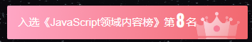

## 前言

最近想学习一下桌面的应用开发，然后发现了 electron 这个神奇的东西 ，有了它以后写桌面应用和写网页一样，美滋滋。但是还是得学学它的使用方法 （[electronjs 官网](https://www.electronjs.org/)），感觉还不错嘿嘿~

本来想用 vue3 + vite 写，但是发现 electron 与 vite 一起的话，要配置很多东西，特麻烦，而使用 vue-cli 的话可以一键快速搭建。所以就用它了 QAQ （不想折磨自己）

本文详细记录了我是如何搭建起来并打包成应用滴并不是完整项目噢，如果有错欢迎指点~

使用了这些： Vue3 + Vue-Cli + electron + sass + element-Plus + vuex + vue-router

入选 csdn 热榜第八嘿嘿<br>


## 一、创建 Vue3 项目

项目路径不能有中文！

### 1.使用脚手架安装

```bash
# demo 为项目名字，可以自己定，不能有大写字母和中文
vue create demo
```

### 2.选择 Vue3


### 3.创建完毕后测试一下


进入项目目录

```bash
npm run serve
```

看到这个界面说明创建成功咯~


### 4.安装 router

#### （1）安装

```bash
npm i vue-router@4
```

#### （2）创建路由文件

在项目的 `src `目录下创建 `router/index.js` 。内容如下：

```js
import { createRouter, createWebHashHistory } from 'vue-router'

const routes = [
  {
    path: '/',
    component: () => import('@/components/HelloWorld'),
  },
]
export const router = createRouter({
  history: createWebHashHistory(),
  routes: routes,
})

export default router
```

#### （3）main.js 注册

```js
import router from './router'
createApp(App).use(router).mount('#app')
```

#### （4）App.vue

在 App.vue 中加入 `<router-view /> ` 就可以测试是否安装成功啦 （把原本组件的代码删掉）

### 5.安装 Vuex（按需安装）

PS : Vuex 和 sass 都可以不安装，不影响 electron 使用。

#### （1）安装

```bash
npm i vuex -s
```

#### （2）创建 store 文件

在项目的 `src `目录下创建 `store/index.js` 。内容如下：

```js
import { createStore } from 'vuex'

export default createStore({
  state: {
    test: '测试一下哈哈哈',
  },
  mutations: {},
  actions: {},
  modules: {},
})
```

#### （3）main.js 注册

```js
import store from './store'
createApp(App).use(store).use(router).mount('#app')
```

#### （4）测试

`HelloWorld.vue` 。控制台有输出就可以了噢

```js
import { useStore } from 'vuex'
export default {
  name: 'HelloWorld',
  setup() {
    const store = useStore()
    console.log(store.state.test)
  },
}
```

### 6.安装 Sass（按需安装）

#### （1）安装

```bash
npm i node-sass sass-loader style-loader -d
```

#### （2）测试

组件中 `<style lang="scss" scoped> ` 不报错即可

### 7.element-Plus（按需安装）

#### （1）安装

```bash
npm install element-plus --save
```

#### （2）按需加载

```bash
npm install -D unplugin-vue-components unplugin-auto-import
```

在项目的 `webpack.config.js` 添加代码。完整示例如下：

```js
const { defineConfig } = require('@vue/cli-service')
const AutoImport = require('unplugin-auto-import/webpack')
const Components = require('unplugin-vue-components/webpack')
const { ElementPlusResolver } = require('unplugin-vue-components/resolvers')

module.exports = defineConfig({
  transpileDependencies: true,
  configureWebpack: {
    plugins: [
      AutoImport({
        resolvers: [ElementPlusResolver()],
      }),
      Components({
        resolvers: [ElementPlusResolver()],
      }),
    ],
  },
})
```

### （3）测试

随便去拿一个组件测试即可，比如按钮。

## 二、安装 Electron

### 1.安装

在项目的终端输入以下命令

```b
vue add electron-builder
```

这里我选择的是目前最新版 13.0.0


### 2.启动项目测试

```ba
npm run electron:serve
```

看到这里就已经成功咯~


### 3.注释掉 DevTools 检测

如果应用没安装 devTools 会自动安装，但是又慢又卡，直接在 `background.js` 注释掉


### 4.配置热加载

每次写代码都要重启太麻烦，建议配置热加载

#### （1）安装插件：

```bash
npm install electron-reloader --save-dev
```

#### （2）在 electron 入口文件加入此代码

默认是 `background.js` 文件

```js
try {
  require('electron-reloader')(module)
} catch (_) {}
```

## 三、打包

项目目录不能有中文，而且打包速度是真滴慢，用科学上网好点，也可以提前下载对应的文件到本地。

```ba
npm run electron:build
```

打包完成后在项目的 `dist_electron` 文件夹里有安装包和绿色免安装版

安装包路径：`dist_electron/demo Setup 0.1.0.exe`

绿色版：`dist_electron/win-unpacked`

打开康康：


## 四、结尾

到这里就可以像开发网页一样开发软件咯~ 完结撒花~

Tips ：点击应用的控制台后 F5 刷新就可以像网页一样重新载入 vue 噢~

看到这里就不要白嫖了吧，只需要点赞就行阿里嘎多~

我滴个人网站：`www.dddhl.cn` ，欢迎来踩踩~
