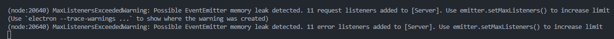
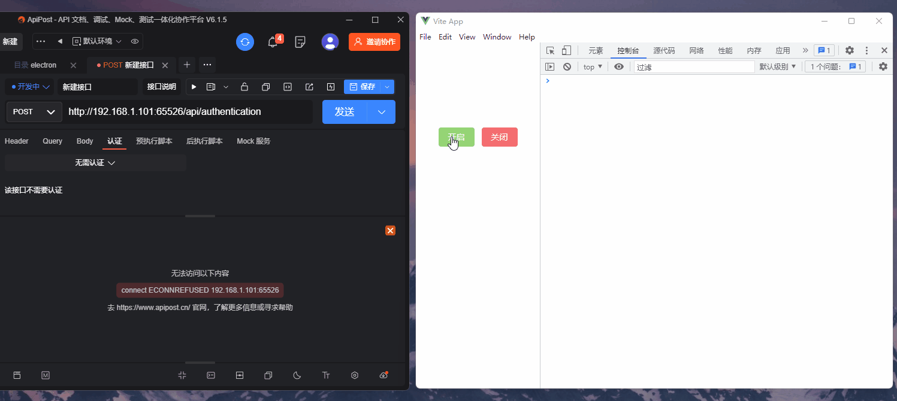

## 前言

用`electron`写了一个自己用的小软件，无后端，纯本地的数据。最近想着开发一个手机端app，将PC端的数据进行同步。为了这小小的功能单独写个后端又麻烦。干脆前后端不分离哈哈，直接在前端软件中开启接口。

## 一、主要实现原理

`electron`本身就集成了`Nodejs`，简直是不要太舒服。直接用最基本的`http模块`开接口即可，也可以用`express`，看个人喜好。下面演示的是`http模块`。

## 二、获取本机局域网IP

首先要获取本机局域网的IP，这就是接口的IP地址了。

```js
// 获取本机的局域网IP
function getServerIp() {
  let interfaces = os.networkInterfaces();
  for (let devName in interfaces) {
    let iface = interfaces[devName];
    for (let i = 0; i < iface.length; i++) {
      let alias = iface[i];
      if (alias.family === 'IPv4' && alias.address !== '127.0.0.1' && !alias.internal) {
        return alias.address;
      }
    }
  }
}
```

## 三、开启服务器

这里的`closeSever()`是防止服务被重新开启导致冲突报错。一般来说开启服务器后，前端要做限制。

```js
// 开启局域网接口
function openServer(): Promise<string> {
  // 防止重复开启
   closeServer()

  // 获取本机的局域网IP和自定义端口
  let SERVER_PORT = 65526
  let SERVER_IP = getServerIp()

  server = http.createServer()
  server.on('request', (req: any, res: any) => {
    // 防止跨域
    res.writeHead(200, { "Content-Type": "application/json;charset=utf-8", "access-control-allow-origin": "*" })

    // 监听 '/api/authentication'
    if (req.method === 'POST' && req.url === '/api/authentication') {
      let context = {
        code: 200,
        data: { type: 'Hello World!' }
      }
      res.end(JSON.stringify(context))
    }
  })

  // 返回端口开启结果
  return new Promise<string>((resolve, reject) => {
    server.listen(SERVER_PORT, SERVER_IP, () => {
      // 服务器正确开启
      resolve(`服务器开启成功，服务器地址: http://${SERVER_IP}:${SERVER_PORT}`)
    })
    server.on('error', (err: any) => {
      if (err.code === 'EADDRINUSE') {
        // 服务器端口已经被使用
        reject(`端口:${SERVER_PORT}被占用,请更换占用端口`)
      }
    })
  })
}
```

## 四、关闭服务器

这里有个小坑，如果单纯通过 `server.close()` 关闭服务，重复开关10次后会出警告。大致意思是监听端口过多，解决办法是关闭服务器时将监听也移除。



```js
// 关闭server
function closeServer(): void {
  server && server.removeAllListeners();
  server && server.close(() => {
    console.log("服务接口关闭");
  });
}
```

## 五、简单演示

局域网内设备都可以访问接口，已测试手机APP访问接口成功，要注意跨域问题。



## 六、整体代码

`server.ts`

```js
const os = require('os');
const http = require('http')
let server: any

// 开启局域网接口
function openServer(): Promise<string> {
  // 防止重复开启
  closeServer()

  // 获取本机的局域网IP和自定义端口
  let SERVER_PORT = 65526
  let SERVER_IP = getServerIp()

  server = http.createServer()
  server.on('request', (req: any, res: any) => {
    // 防止跨域
    res.writeHead(200, { "Content-Type": "application/json;charset=utf-8", "access-control-allow-origin": "*" })

    // 监听 '/api/authentication'
    if (req.method === 'POST' && req.url === '/api/authentication') {
      let context = {
        code: 200,
        data: { type: 'Hello World!' }
      }
      res.end(JSON.stringify(context))
    }
  })

  // 返回端口开启结果
  return new Promise<string>((resolve, reject) => {
    server.listen(SERVER_PORT, SERVER_IP, () => {
      // 服务器正确开启
      resolve(`服务器开启成功，服务器地址: http://${SERVER_IP}:${SERVER_PORT}`)
    })
    server.on('error', (err: any) => {
      if (err.code === 'EADDRINUSE') {
        // 服务器端口已经被使用
        reject(`端口:${SERVER_PORT}被占用,请更换占用端口`)
      }
    })
  })
}

// 关闭server
function closeServer(): void {
  server && server.removeAllListeners();
  server && server.close(() => {
    console.log("服务接口关闭");
  });
}

// 获取本机的局域网IP
function getServerIp() {
  let interfaces = os.networkInterfaces();
  for (let devName in interfaces) {
    let iface = interfaces[devName];
    for (let i = 0; i < iface.length; i++) {
      let alias = iface[i];
      if (alias.family === 'IPv4' && alias.address !== '127.0.0.1' && !alias.internal) {
        return alias.address;
      }
    }
  }
}

export {
  openServer,
  closeServer
}
```

## 七、展望

如果想把接口开放到外网，我目前只知道用路由器本机地址内网穿透。不过挺麻烦，小软件不需要这么多需求。还有，我想问下`uniapp`能否像这个一样在前端开启接口？找了挺久都没有方案。希望有大佬解答一下~
