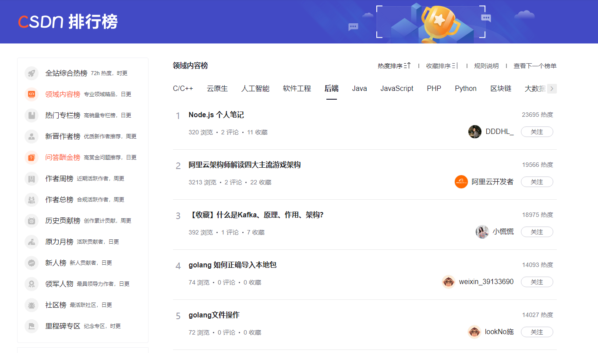

<h3>分享一下 node.js 学习笔记。已同步发布在 CSDN，获得排名太开心了！mark 一下~</h3>




## 一、fs 模块

引用

```js
const fs = require('fs')
```

### 1.fs.readFile()

```js
// options 代表编码格式读取
fs.readFile(path, [, options], callback)
```

```js
// 示例 读取成功 err=null 读取失败 data=undefined
fs.readFile('./files/11.text', 'utf8', function (err, data) {
  if (err) {
    return console.log('读取失败' + err)
  }
  console.log(data)
})
```

### 2.fs.writeFile()

没有该文件就创建，但是不能创建目录

写入会覆盖原文件

```js
// options 默认值utf8
fs.writeFile(path,data[,options],callback)
```

```js
// 示例 写入失败 err为错误对象，写入成功 err=null
fs.writeFile('./files/11.text', 'hello', function (err) {
  if (err) {
    return console.log('写入失败' + err)
  }
})
```

### 3.文件路径问题

### （1）\_\_dirname

表示当前 `js` 的目录

```js
console.log(__dirname)
```

```js
fs.readFile(__dirname + '/files/1.txt', 'uft8', function (err, data) {
  console.log(err)
  console.log(data)
})
```

### （2）path 模块

```js
const path = require('path')
path.join()     				// 将多个路径片段拼接
path.basename(path[,ext]) 		// 从路径字符串中取出文件名
path.extname(path)				// 从路径字符串中取出文件扩展名
```

```js
// 演示
const pathStr = path.join('/a', '/b/c', '../', '/d', '/e')
console.log(pathStr) // \a\b\d\e
const pathStr2 = path.join(__dirname, './files/1.txt')

const fpath = '/a/b/c/index.html'
var fullName = path.basename(fpath) // index.html
var fullName2 = path.basename(fpath, '.html') // index.html

var fext = path.extname(fpath) // .html
```

## 二、http 模块

```js
const http = require('http')
```

### 1.http.createServer()

创建 web 服务器实例

```js
const server = http.createServer()
```

### 2.server.on()

为服务器实例绑定 request 事件，监听客户端发送的请求

```js
server.on('request', (req, res) => {
  console.log(req.url) // 客户端请求地址
  console.log(req.method) // 客户端请求方法
  // 防止中文乱码，设置响应头
  res.setHeader('Content-type', 'text/html; charset=utf-8')
  res.end('Hello World') // 给客户端发送指定内容并结束这次请求
})
```

### 3.server.listen()

启动 web 服务器监听端口

80 端口可省略 http://127.0.0.1

```js
server.listen(80, () => {})
```

### 4.简单路由演示

```js
const http = require('http')
const server = http.createServer()
server.on('request', (req, res) => {
  // 获取请求的 url 地址
  const url = req.url
  // 设置默认响应内容
  let content = '<h1>404 Not found!<h1>'
  // 判定路径设置返回内容
  if (url === '/' || url === '/index.html') {
    content = '<h1>首页</h1>'
  } else if (url === '/about.html') {
    content = '<h1>关于页面</h1>'
  }
  res.setHeader('Content-Type', 'text/html; charset=utf-8')
  res.end(content)
})
server.listen(80, () => {
  console.log('服务器启动:' + 'http://127.0.0.1')
})
```

## 三、模块化

### 1.加载模块

```js
// 加载内置模块
const fs = require('fs')
// 加载用户的自定义模块
const custom = require('./custom.js')
// 加载第三方模块
const moment = require('moment')
```

### 2.模块作用域

导入模块时，里面的变量及函数只能有该模块 js 能访问。好处：防止变量污染

而在 html 中，导入 js 后能访问变量和函数，这样会导致多个 js 的变量重复，会被覆盖

```js
// test.js
const name = 'lhd'
function sayHello() {
  console.log('Hello World ', name)
}
```

```js
// index.js
const custom = require('./test')
console.log(custom) // 输出:{} 访问不了里面的变量和函数
```

### 3.向外共享模块作用域中的成员

简称暴露

#### （1）module 对象

每个 .js 自定义模块中都有一个 module 对象，导入模块时，其实是导入 module.exports 指向的对象。默认值为 {}

#### （2）module.exports

在 module.exports 对象上挂载属性方法

```js
// test.js
module.exports.name = 'lhd'
module.exports.sayHello = function () {
  console.log('Hello World ')
}
```

```js
// index.js
const custom = require('./test')
console.log(custom) // {name:lhd,sayHello:[Function]}
```

#### （3）exports

简化 module.exports。默认情况下 exports 和 module.exports 指向同一个对象。最终结果以 module.exports 指向的对象为准

```js
// test.js
exports.name = 'lhd'
exports.sayHello = function () {
  console.log('Hello World ')
}
```

```js
// index.js
const custom = require('./test')
console.log(custom) // {name:lhd,sayHello:[Function]}
```

#### （4）同时使用注意事项

使用 require() 模块时，得到的永远是 module.exports 指向的对象

建议只用一种方式，以防混淆


#### （5）CommonJS 规范

- 每个模块内部，module 变量代表当前模块。
- module 变量是一个对像，它的 exports 属性（即 module.exports)是对外的接口。
- 加载某个模块，其实是加载该模块的 module.exports 属性。require(0 方法用于加载模块。

## 四、npm 与 包

### 1.什么是包

Node.js 中第三方模块又叫做 `包`。

### 2.包共享平台

包是由第三方个人或团队开发出来，免费开源

[www.npmjs.com](www.npmjs.com)

### 3.安装包

在包共享平台中，每个包都有会使用说明

```bash
# 默认安装最新
npm install 包名称
npm i 包名称

# 安装多个
npm i 包名称 包名称

# 指定安装版本
npm install 包名称@x.xx.x			// x.xx.x为版本
# 第一个x代表大版本，第二个代表功能版本，第三个代表 Bug 修复版本
```

### 4.切换下包镜像源

下载包速度慢，可以使用镜像服务器

```bash
# 查看当前的下包镜像源
npm config get registry
# 将下包的镜像源切换为淘宝镜像源
npm config set registry=https://registry.npm.taobao.org/
# 检查
npm config get registry
```

### 5.nrm

为了更方便的切换下包的镜像源，我们可以安装 `nrm`，可快速查看和切换镜像源

```bash
# 通过 npm 包管理器，将 nrm 安装为全局可用的工具
npm i nrm -g
# 查看所有可用的镜像源 *号代表目前使用的镜像源
nrm ls
# 将下包镜像源切换为淘宝镜像
nrm use taobao
```

### 6.安装完包

初次装包完成后，在项目文件夹下多一个叫做 `node modules` 的文件夹和 `package-lock.json` 的配置文件。不要手动修改里面的东西，npm 包管理工具会自动维护。

`node modules` 文件夹用来存放所有已安装到项目中的包。require() 导入第三方包时，就是从这个目录中查找并加载包。

`package-lock.json` 配置文件用来记录 `node modules` 目录下的晦一个包的下载信息，例如包的名字、版本号、下载地址等。

### 7.dependencies

作用：在 `package.json` 中记录核心依赖包信息

正常安装默认为核心依赖包

### 8.devDependencies

作用：在 `package.json` 中记录开发依赖包信息

如果某些包只在项目开发阶段用到，在项目上线以后不会用到，建议把这些包记录在 `devDependencies` 中。相反，如果在开发及上线都用到，则记录在 `dependencies` 中。一般来说依据官方使用说明安装即可

```bash
# 安装到 devDependencies
npm i 包名称 -D
npm install 包名称 --save-dev
```

### 9.共享代码

由于第三方包(node_modules)体积过大，不方便分享代码，所以共享时应剔除 `node_modules`

项目根目录下创建 `package.json` ，记录安装了哪些包。使用 git 时应把 `node_modules` 添加到 `.gitignore` 中。

```bash
# 编写代码前先创建 package.json 项目目录不能有中文和空格
# 安装包时，会自动记录包信息到 package.json
npm init -y

# 一次性安装所有的包
npm install
npm i
```

### 10.卸载包

```bash
# 会自动处理 package.json
npm uninstall 包名称
npm uni	包名称
```

### 11.模块加载机制

模块在第一次加载后会被缓存。这也意味着多次调用 require0 不会导致模块的代码被执行多次。
注意：不论是内置模块、用户自定义模块、还是第三方模块，它们都会优先从缓存中加载，从而提高模块的加载效率。

- 内置模块加载优先级最高。
- 加载自定义模块时，应指定 ./ 或者 ../ 开头的路径，如果没有将被认为内置模块或者第三方模块。
- 如果加载自定义模块时省略扩展名，则会以 `.js` 、`.json` 、`.node` 进行尝试加载，如果没有则加载失败。
- 加载第三方模块时，会先从父级目录寻找 `node_modules` ，如果父级没有则依次往上寻找。
- 把目录当作模块标识符加载时，会在被加载的目录下查找 `package.json` 并寻找 main 属性，作为加载的入口。如果没有或者无法解析，则会加载目录下的 index.js 文件。

## 五、Express

Web 开发框架。封装 http 内置模块的第三方包

### 1.安装

```bash
npm i express
npm i express@4.17.1
```

### 2.创建基本的 Web 服务器

```js
// 导入express
const express = require('express')
// 创建 web 服务器
const app = express()

// 调用 app.listen
app.listen(80, () => {
  console.log('express server running at http://127.0.0.1')
})
```

### 3.监听 GET 请求

```js
// req：请求对象（包含了与请求相关的属性和方法）
// res：响应对象（包含了与响应相关的属性和方法）
app.get('请求url', function (req, res) {
  // 处理函数
})
```

### 4.监听 POST 请求

```js
// req：请求对象（包含了与请求相关的属性和方法）
// res：响应对象（包含了与响应相关的属性和方法）
app.post('请求url', function (req, res) {
  // 处理函数
})
```

### 5.把内容响应给客户端

res.send()

```js
app.get('/user', (req, res) => {
  res.send({ name: 'lhd', age: '19' })
})
```

### 6.获取 URL 中携带的查询参数

req.query

```js
app.get('/', (req, res) => {
  console.log(req.query)
})
```

### 7.获取 URL 中的动态参数

通过 req.params 对象，可以访问到 URL 中，通过 `:` 匹配到的动态参数

```js
// 访问 http://127.0.0.1/user/1874
app.get('/user/:id', (req, res) => {
  res.send(req.params) // 返回 {id:'1874'}
})
// 访问 http://127.0.0.1/user/1874/lhd
app.get('/user/:id/:name', (req, res) => {
  res.send(req.params) // 返回 {id:'1874',name:'lhd'}
})
```

### 8.托管静态资源

通过 express.static() 创建静态资源服务器。可将图片、`css` 文件、`js` 文件对外开放访问。

```js
// 将 public 目录下资源提供访问。多个目录请多次调用
// 访问地址：http://localhost:端口号/xxx.html
app.use(express.static('./public'))

// 挂载路径前缀
// 访问地址：http://localhost:端口号/public/xxx.html
app.use('/public', express.static('./public'))
```

### 9.nodemon

类似热更新的工具

编写调试 Node.js 项目时，如果修改了代码则需要重新启动项目才可以使用，使用 `nodemon` 工具修改代码时可以自动帮我们重启项目，方便开发

#### （1）安装

```bash
// 安装为全局可用工具
npm i nodemon -g
```

#### （2）使用

```bash
// 原本启动
node app.js
// nodemon 启动
nodemon app.js
```

## 六、Express 路由

在 Express 中，路由指的是客户端的请求与服务器处理函数之间的映射关系。
Express 中的路由分 3 部分组成，分别是请求的类型、请求的 URL 地址、处理函数。

```js
// METHOD:请求方式，PATH:请求路径，HANDLER:处理函数
app.METHOD(PATH, HANDLER)
```

### 1.普通路由

挂载到 app 上

```js
// 示例：使用 get 请求返回 get，使用 post 返回 post
app.get('/', (req, res) => {
  res.send('This is GET request')
})
app.post('/', (req, res) => {
  res.send('This is POST request')
})
```

### 2.模块化路由

为了方便对路由进行模块化管理，Express 不建议将路由直接挂载到 app 上，而是推荐将路由抽离为单独的模块。

步骤：

1. 创建路由模块对应的 `.js` 文件
2. 调用 express.Router() 创建路由对象
3. 向路由对象上挂载具体的路由
4. 使用 module.exports 向外共享路由对象
5. 使用 app.use() 注册路由模块

演示：

```js
// ./router/user.js
var express = require('express') // 导入express
var router = express.Router() // 创建路由对象

// 挂载具体路由
router.get('/user/list', (req, res) => {
  res.send('Get user list')
})
router.post('/user/add', (req, res) => {
  res.send('Add new user')
})

module.exports = router // 向外导出路由对象
```

```js
// ./app.js
const express = require('express')
const app = express()
const userRouter = require('./router/user.js') // 导入路由模块

app.use(userRouter) // 注册路由模块

app.listen(80, () => {
  console.log('http://127.0.0.1')
})
// 访问地址: http://127.0.0.1/user/list
```

为路由模块添加前缀

```js
// 访问地址: http://127.0.0.1/api/user/list
app.use('/api', userRouter)
```

## 七、Express 中间件

请求到达 Express 服务器之后，可连续调用多个中间件，从而对这次请求进行预处理。

和 vue 的路由守卫一样，next()代表放行

### 1.过程


### 2.中间件格式

本质上就是一个 function 处理函数，格式如下：


### 3.next() 函数

next() 函数是实现多个中间件连续调用的关键，它表示把流转关系转交给下一个中间件或者路由。


### 4.定义中间件函数

```js
// mw 指向的就是一个中间件函数
const mw = function(req.res,next){
    console.log('这是个简单的中间件函数')
    next()
}
```

### 5.全局生效的中间件

只要有请求到达服务器，必先经过 mw 中间件函数处理。相对于 vue 前置守卫，拦截器

```js
// mw 指向的就是一个中间件函数
const mw = function(req.res,next){
    console.log('这是个简单的中间件函数')
    next()
}

// 全局生效的中间件
app.use(mw)
```

简化

```js
app.use(function (req, res, next) {
  console.log('这是给简单的中间件函数')
  next()
})
```

### 6.中间件作用

多个中间件之间，共享同一份 req 和 res。基于这样的特性，我们可以在上游的中间件中，统一为 req 或 res 对象添加自定义的属性或方法，供下游的中间件或路由进行使用。

```js
// 示例：每个请求都需要获取时间
app.use((req, res, next) => {
  req.startTime = Date.now()
  next()
})
app.get('/user', (req, res) => {
  res.send('time:' + req.startTime)
})
```

### 7.多个中间件

按注册顺序排，且必须在路由上方。多个中间件共享 req 和 res。

```js
// 完整示例
const express = require('express')
const app = express()

app.use((req, res, next) => {
  console.log('第一个中间件')
  next()
})
app.use((req, res, next) => {
  console.log('第二个中间件')
  next()
})

app.get('/', (req, res) => {
  res.send({ info: '请求了服务器', method: req.method })
})

app.listen(80, () => {
  console.log('http://127.0.0.1')
})
```

### 8.局部生效的中间件

```js
const mw = function (req, res, next) {
  console.log('中间件函数')
  next()
}
app.get('/', mw, (req, res) => {
  res.send('Hellow World')
})
app.get('/user', (req, res) => {
  res.send('Hellow World')
})
```

### 9.多个局部中间件

```js
// mw1与mw2 为中间件函数，两种方式等价
app.get('/', mw1, mw2, (req, res) => {
  xxx
})
app.get('/', [mw1, mw2], (req, res) => {
  xxx
})
```

### 10.中间件的分类

#### （1）应用级别的中间件

通过 app.use() 或者 app.get() 或 app.post() ,绑定到 app 实例上的中间件。

#### （2）路由级别的中间件

绑定到 express.Router() 实例上的中间件。

用法与应用级别中间件一致。

```js
var app = express()
var router = express.Router()

router.use((req, res, next) => {
  console.log('路由级别中间件')
  next()
})
app.use('/', router)
```

#### （3）错误级别的中间件

专门用来捕获项目中发生的异常错误，从而防止项目崩溃。

格式：处理函数中必须有 4 个形参 (err,req,res,next)

特点：必须注册在所有路由之后

```js
// 示例
app.get('/', (req, res) => {
  throw new Error('服务器出错') // 错误发生后，下面的语句无法执行
  res.send('Hellow World') // 无法响应
})
app.use((err, req, res, next) => {
  console.log('发生了错误' + err.message)
  res.send('Error!' + err.message) // 捕获错误，向客户端响应
})
```

#### （4）Express 内置中间件

express@4.16.0版本开始，内置了 3 个常用的中间件

`express.static` 快速托管静态资源的内置中间件 (无兼容性)

`express.json` 解析 JSON 格式的请求体数据 (仅在 4.16.0 +可用)

`express.urlencoded` 解析 URL-encoded 格式的请求体 (仅在 4.16.0 +可用)

```js
// 配置解析 application/json 格式数据的内置中间件
app.use(express.json())
// 配置解析 application/x-www-form-urlencoded 格式数据的内置中间件
app.use(express.urlencoded({ extended: false }))
```

演示：

```js
const express = require('express')
const app = express()

// 注意：除了错误级别的中间件，其他的中间件，必须在路由之前进行配置
// 通过express.json()这个中间件，解析表单中的JSON格式的数据
app.use(express.json())

// 通过express.urlencoded()这个中间件，来解析表单中的url-encoded格式的数据
app.use(express.urlencoded({ extended: false }))

app.post('/user', (req, res) => {
  // 在服务器，可以使用req.body这个属性，来接收客户端发送过来的请求体数据
  // 默认情况下，如果不配置解析表单数据的中间件，则req.body默认等于undefined
  console.log(req.body)
  res.send('ok')
})
app.post('/book', (req, res) => {
  // 在服务器端，可以通过req,body来获取JSON格式的表单数据和url-encoded格式的数据
  console.log(req.body)
})
```

#### （5）第三方中间件

非官方内置，由第三方开发出来的中间件叫第三方中间件，可用按需加载和配置

例如：在 express@4.16.0 之前的版本中，经常使用 body-parser 这个第三方中间件来解析请求体数据。

使用步骤如下：

1. 使用 `npm i body-parser` 安装
2. 使用 `require` 导入中间件
3. 使用 `app.use()` 注册并使用中间件

演示：

```js
const parser = require('body-parser')
app.use(parser.urlencoded({ extended: false }))
```

### 11.自定义中间件

自定义一个解析请求体数据的中间件并使用

```js
const express = require('express')
const app = express()

// 自定义中间件函数，解析请求体数据
const parserBody = function (req, res, next) {
  let str = ''
  // 请求数据过大时，data会分段发送，所以用on绑定data事件，监听data返回的数据并组装
  req.on('data', (chunk) => {
    str += chunk
  })
  // 当数据发送完毕后，会触发end事件，所以在end处将数据挂载为body传给路由
  req.on('end', () => {
    req.body = str
    next()
  })
}
// 注册全局中间件
app.use(parserBody)

app.post('/', (req, res) => {
  // 在此可以拿到挂载的数据并返回数据
  res.send('返回的数据：', req.body)
})

app.listen(80, () => {
  console.log('http://127.0.0.1')
})
```

测试结果：


### 12.封装自定义中间件

```js
// test.js
function test(req, res, next) {
  /*中间件处理函数*/
}
module.exports = test // 暴露出去

// app.js
const test = require('./test') // 导入自定义中间件
app.use(test) // 注册
```

## 八、CORS 中间件

### 1. 基本使用

安装

```bash
npm i cors
```

使用

```js
// app.js
const cors = require('cors') // 导入
app.use(cors()) // 配置中间件，需在路由之前
```

### 2. CORS 响应头部

#### （1）Access-Control-Allow-Origin

响应头部可以携带一个 `Access-Control-Allow-Origin` 字段，语法如下

```js
// origin 参数的值指定了只允许访问该资源的外域 url
Access-Control-Allow-Origin:<origin>|*
```

示例：

```js
// 只允许来自 http://127.0.0.1 的请求
res.setHeader('Access-Control-Allow-Origin', 'http://127.0.0.1')
```

```js
// 允许任何域的请求
res.setHeader('Access-Control-Allow-Origin', '*')
```

#### （2）Access-Control-Allow-Headers

默认情况下，CORS 仅支持客户端向服务器发送如下 9 个请求头：

Accept、Accept-Language、Content-Language、DPR、Downlink、Sava-Data、Viewport-width、Width、Content-Type（值仅限于 text/plain、multipart/form-data、application/x-www-form-urlencoded 三者之一)

如果客户端向服务器发送额外的请求头信息，则需要在服务器端，通过 `Access-Control-Allow-Headers` 对额外请求头进行声明，否则请求失败。

示例：

```js
// 允许客户端额外向服务器发送Content-Type请求头和X-Custom-Header请求头
// 注意：多个请求头之间使用英文的逗号进行分割
res.setHeader('Access-Control-Allow-Headers', 'Content-Type,X-Custom-Header')
```

#### （3）Access-Control-Allow-Methods

默认情况下，CORS 仅支持客户端发起 GET、POST、HEAD 请求。
如果客户端希望通过 PUT、DELETE 等方式请求服务器的资源，则需要在服务器端，通过`Access-Control-Alow-Methods` 来指明实际请求所允许使用的 HTTP 方法。

示例：

```js
// 只允许POST、GET、DELETE、HEAD请求方法
res.setHeader('Access-Control-Allow-Methods', 'POST,GET,DELETE,HEAD')
// 允许所有的HTTP请求方法
res.setHeader('Access-Control-Allow-Methods', '*')
```

### 3.CORS 请求分类

#### （1）简单请求

同时满足以下两大条件的请求，就属于简单请求：

- 请求方式：GET、POST、HEAD 三者之一
- HTTP 头部信急不超过以下几种字段：无自定义头部字段、Accept、Accept-Language、Content-Language、DPR、Downlink、Save-Data、Viewport-Width、Width、Content-Type(只有三个值 application/x-www-form-urlencoded 、multipart/form-data、text/plain)

#### （2）预检请求

只要符合以下任何一个条件的请求，都需要进行预检请求：

- 请求方式为 GET、POST、HEAD 之外的请求 Method 类型
- 请求头中包含自定义头部字段
- 向服务器发送了 application./json 格式的数据

在浏览器与服务器正式通信之前，浏览器会先发送 OPTION 请求进行预检，以获知服务器是香允许该实际请求，所以这一次的 OPTION 请求称为“预检请求”。服务器成功响应预检请求后，才会发送真正的情求，并且携带真实数据。

#### （3）简单请求与预检请求区别

简单请求的特点：客户端与服务器之间只会发生一次请求。
预检请求的特点：客户端与服务器之间会发生两次请求，OPTION 预检请求成功之后，才会发起真正的请求。

## 九、JSONP

概念：浏览器端通过 `<script>` 标签的 `src` 属性，请求服务器上的数据，同时，服务器返回一个函数的调用。这种请求数据的方式叫做 JSONP。

特点：

- JSONP 不属于真正的 Ajax 请求，因为它没有使用 `XMLHttpRequest` 这个对象，
- JSONP 仅支持 GET 请求，不支持 POST、PUT、DELETE 等请求。

### 1.实现 JSONP 接口

步骤：

- 获取客户端发送过来的回调函数的名字
- 得到要通过 JSONP 形式发送给客户端的数据
- 根据前两步得到的数据，拼接出一个函数调用的字符串
- 把上一步拼接得到的字符串，响应给客户端的 `<script>` 标签进行解析执行

演示：

```js
// 服务器端
app.get('/api/jsonp',(req,res)=>
	//1.获取客户端发送过来的回调函数的名字
	const funcName req.query.callback
	/2.得到要通过JSONP形式发送给客户端的数据
	const data = { name:'lhd',age:19 }
	//3.根据前两步得到的数据，拼州接出一个函数调用的字符串
    // xxx = `$(funcName)(${JSON.stringify(data)})` md文档不识别``
	const scriptstr = xxx
	//4.把上步拼接得到的字符串，响应给客户端的<scr1pt>标签进行解析执行
	res.send(scriptstr)
})
// 客户端
$.ajax({
    method:'GET',
	url:'http://127.0.0.1/api/jsonp',
	dataType:'jsonp', 					//表示要发起J50NP的i情球
	success:function (res){
		console.log(res)
	}
})
```

## 十、MySQL

安装模块

```bash
npm i mysql -y
```

### 1.基本使用

```js
// 1.导入 MySQL 模块
const mysql require('mysql')
// 2.建立与 MySQL 数据车的连接
const db = mysql.createPool({
	host:'127.0.0.1:3306',	// 数据库的IP地址
	user:'root',			// 登录数据库的账号
	password:'123456',		// 登录数据的密码
	database:'my_db_01'		// 指定要操作哪个数据库
    // port:'3306'			   默认为3306，所以可以不写
})
// 检查 MySQL 模块能香正常工作
db.query('SELECT 1',(err,results)=>
	if (err)return console.log(err.message)
	// 只要能打印出【RowDataPacket{'1'：1}】的结果，就证明数据库连接正常
	console.log(results)
})
```

### 2.查询数据

```js
const strSql = 'select * from test' // test是我的数据库表
db.query(strSql, (err, results) => {
  if (err) console.log(err)
  console.log(results)
})
```

### 3.插入数据

```js
const strSql = 'insert into test(name) value (?) ' // test是我的数据库表 ?代表占位符
const user = { name: 'ddd' } // name是我的数据库字段
db.query(strSql, [user.name], (err, results) => {
  if (err) console.log(err)
  console.log(results)
})
```

### 4.简单封装

我以自己的思路封装一下

```js
// mysql.js 封装的插入函数
const mysql = require('mysql')

// 连接数据库
const db = mysql.createPool({
  host: '127.0.0.1',
  user: 'root',
  password: '',
  database: 'bookshop',
})

// 向test表插入name
function add(data) {
  let strSql = 'insert into test (name) value (?)'
  return new Promise((resolve, reject) => {
    db.query(strSql, [data], async (err, results) => {
      if (err) reject(err.message)
      resolve(results)
    })
  })
}

module.exports = add
```

```js
// app.js
const express = require('express')
const app = express()
const add = require('./mysql')

// 解析 json 数据
app.use(express.json())

app.post('/', (req, res) => {
  add(req.body.name)
    .then(() => {
      res.send({ code: '', message: '插入成功' })
    })
    .catch(() => {
      res.send({ code: '1001', message: '插入失败' })
    })
})

// 捕捉异常中间件
app.use((err, req, res, next) => {
  console.log('发生了错误!' + err.message)
  res.send('Error!' + err.message) // 捕获错误，向客户端响应
})

app.listen(80, () => {
  console.log('http://127.0.0.1')
})
```


## 十一、前后端身份认证

### 1. Session

中间件，配合 cookie 使用，默认不支持跨域

#### （1）安装

```bash
npm i express-session
```

#### （2）使用

```js
var session = require('express-session')

app.use(
  session({
    secret: 'keyboard cat', // secret值可为任意字符串
    resave: false,
    saveUninitialized: true,
  })
)
```

#### （3）存储 session 数据

```js
app.post('/api/login', (req, res) => {
  //判断用户提交的登录信息是否正确
  if (req.body.username !== 'admin' || req.body.password !== '000000') {
    return res.send({ status: 1, msg: '登录失败' })
  }
  req.session.user = req.body
  //将用户的信息，存储到Session中
  req.session.islogin = true
  //将用户的登录状态，存储到Session中
  res.send({ status: 0, msg: '登录成功' })
})
```

#### （4）读取 session 数据

```js
//获取用户姓名的接口
app.get('/api/username',(req,res)=>{
	//判断用户是否登录
	if (!req.session.islogin){
		return res.send({status:1,msg:'fail'})
    }
	res.send({status:0,msg:'success',username:req.session.user.username }
})
```

#### （5）清空 session 数据

```js
//退出登录的接口
app.post('/api/logout',(req,res)=>
	//清空当前客户端对应的session信息
    req.session.destroy()
	res.send({
		status:0,
		msg:'退出登录成功'
	})
})
```

## 2. JWT

JSON Web Token ，支持跨域认证 , 通常由三部分组成 ：header （头部）、Playload （有效荷载，加密信息）、Signature（签名）。由 . 分割

```js
Header.Playload.Signature
```

#### （1）安装

```bash
# jsonwebtoken 用于生成 JWT 字符串
# express-jwt 用于将 JWT 字符串解析还原成JSON对像
npm i jsonwebtoken express-jwt
```

#### （2）导入

```js
//1,导入用于生成 JWT 字符串的包
const createJWT = require('jsonwebtoken')
//2.导入用于将客户端发送过来的 JWT 字符串，解析还原成JSON对象的包
var { expressjwt: jwt } = require('express-jwt')
```

#### （3）定义 Secret 密钥

为了保证 JWT 字符串的安全性，防止 JWT 字符串在网络传输过程中被别人破解，我们需要专门定义一个用于加密和解密的 secret 密钥：

- 当生成 JWT 字符串的时候，需要使用 secret 密钥对用户的信息进行加密，最终得到加密好的 JWT 字符串
- 当把 JWT 字符串解析还原成 JSON 对象的时候，需要使用 secret 密钥进行解密

```js
// 密钥为字符串
const secretKey = 'dddhl ^_^'
```

#### （4）登录后生成 JWT 字符串

```js
// 登录接口
app.post('/api/login', function (req, res) {
  // 省略登录失败情况下的代码
  // 用户登录成功之后，生成WT字符串，通过token属性响应给客户端
  res.send({
    status: 200,
    message: '登录成功',
    // 调用 jwt.sign() 生成 JWT 字符串，三个参数分别是：用户信息对象、加座密钥、配置对象
    // 2h 代表token有效期2小时，s为秒
    token: createJWT.sign({ username: 'lhd' }, secretKey, { expiresIn: '2h' }),
  })
})
```

#### （5）将 JWT 解析还原成 JSON 对象

请求时，请在 Authorization 字段将 token 发送到服务器

```js
// 使用app.use()来注册中间件
// .unless({ path: [/^\/api\//] })用来指定哪些接口不需要访问权限 这里表示的是 api开头的接口都不需要token
app.use(
  jwt({
    secret: secretKey,
    algorithms: ['HS256'],
  }).unless({ path: [/^\/api\//] })
)
```

#### （6）获取解析还原的 JSON 对象

解析完成后，req.auth = 解析出来的对象

```js
app.get('/admin/getinfo',(req,res)=>{
	console.log(req.auth)
	res.send({
		status:200,
		message:'获取用户信息成功l
		data:req.auth
    })
})
```

#### （7）处理 token 过期

```js
app.use(function (err, req, res, next) {
  if (err.name === 'UnauthorizedError') {
    return res.send({ status: 401, message: '登录信息已过期' })
  }
  return res.send({ status: 400, message: '其他错误' })
})
```

#### （8）完整演示

请求登录时发送 username ,不用 token。

服务端生成 token 返回给客户端。

客户端请求解析 token 接口，需要 token。

注意：请求 token 接口时，Header 里需要 Authorization: 'Bearer ' + token 注意 Bearer 后面有个空格隔开 token

```js
const express = require('express')
const createJWT = require('jsonwebtoken')
var { expressjwt: jwt } = require('express-jwt')
const app = express()

// token密钥
const secretKey = 'dddhl ^_^'

// json解析
app.use(express.json())

// token解析
app.use(
  jwt({
    secret: secretKey,
    algorithms: ['HS256'],
  }).unless({ path: [/^\/api\//] })
)

// 登录接口，自动生成token,接收一个username存进token
app.post('/api/login', (req, res) => {
  let token = createJWT.sign({ username: req.body.username }, secretKey, {
    expiresIn: '30s',
  })
  res.send({
    status: 200,
    message: '登录成功',
    token: token,
  })
})

// 测试token解析，发送解析后的数据，请求时需要token
app.get('/token', (req, res) => {
  console.log(req.auth)
  res.send({
    status: '200',
    message: '检测token解析成功',
    data: req.auth,
  })
})

// 处理token过期
app.use(function (err, req, res, next) {
  if (err.name === 'UnauthorizedError') {
    return res.send({ status: 401, message: '登录信息已过期' })
  }
  return res.send({ status: 400, message: '其他错误' })
})

app.listen(80, () => {
  console.log('http://127.0.0.1')
})
```

登录后生成 token：


获取解析后的 token 数据：

