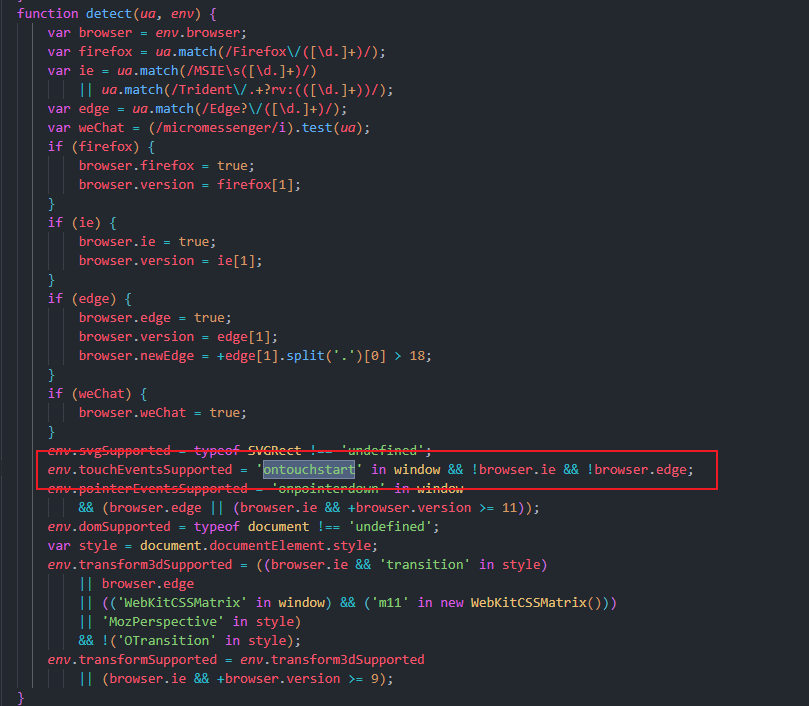

## 一、问题

用echarts绘制了折线图，开启dataZoom功能后，在windows下用鼠标点击拖动与使用移动设备触屏拖动均正常。但是，如果是windows触屏设备，使用触屏时拖不动下方的dataZoom。


在百度和google了一番后发现，原来是官方并没有适配这种设备的触摸事件。在github上也能找到其他人提出的issue，但官方仍未解决问题。


## 二、寻找原因

首先，测试了一下windows触屏拖动时，触发的事件是什么，在测试后发现会触发两种事件：touch、pointer。`mouse事件不会触发`。

结合部分issues提供的方案，查看了一下echarts的源码。可以发现在 node_modules/zrender/zrender.js 中，有这样一句代码，判定当前设备是否为触屏设备。



在控制台输出 `'ontouchstart' in window` 结果为false。


## 三、解决办法

第一种方式：修改源码把判定默认为true，不过这种方式不太好。

第二种方式：手动在window中添加'ontouchstart'事件。相对来说比修改源码方便。

相当于将设备默认为触屏设备。经过测试，不会影响鼠标事件以及其他的echarts图表功能，刚好解决问题。

```js
// app.vue
// 解决Echarts dataZoom无法识别window触屏设备的bug
window.ontouchstart = (e) => {
  e.preventDefault()
}
```

## 四、题外话

dataZoom默认的手柄太小，在触屏设备不好拖动，建议更改成圆形按钮，可以自定义更改样式，修改配置项里的handleIcon即可。


```js
dataZoom:[
    {
        handleIcon: "path://M30.9,53.2C16.8,53.2,5.3,41.7,5.3,27.6S16.8,2,30.9,2C45,2,56.4,13.5,56.4,27.6S45,53.2,30.9,53.2z M30.9,3.5M36.9,35.8h-1.3z M27.8,35.8 h-1.3H27L27.8,35.8L27.8,35.8z"
    }
]
```

