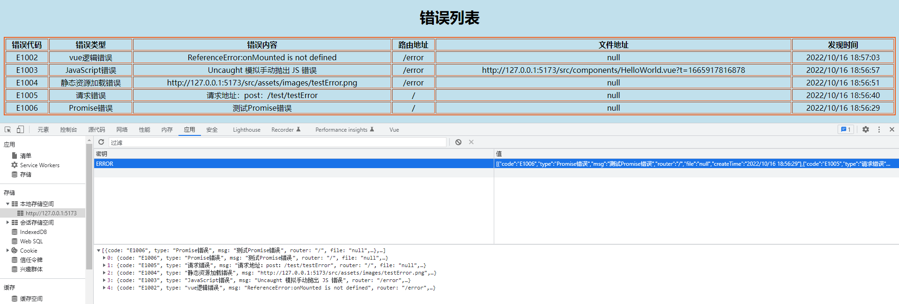

## 前言

在做完一个项目后，之后的维护尤为重要。这时，如果项目配置了错误日志记录，这样能大大减少维护难度。虽然不一定能捕获到全部的错误，但是一般的错误还是可以监测到的。这样就不用测试人员去一遍一遍复现bug了。

## 一、准备工作

### （1）规定错误码

像是请求码（404、500）一样，我觉得错误都应该规定好对应的错误码。个人喜好。

```js
// 错误代码
const errCode = new Map([
  // 本地系统错误
  ['E1001', '系统未知错误'],
  ['E1002', 'vue逻辑错误'],
  ['E1003', 'JavaScript错误'],
  ['E1004', '静态资源加载错误'],
  ['E1005', '请求错误'],
  ['E1006', 'Promise错误']
])
```

### （2）设置错误处理函数

每个项目对于错误的处理不一样，我这边就不写逻辑了。只做了保存日志。

这里导出处理函数是为了手动处理`请求错误`以及`Promise.catch()`中的错误

```js
// 错误处理函数
export const errorHandler = (code: string, msg: string, file = 'null') => {
  // 这里处理监听到的错误
  // 保存错误信息
  saveLog({ code: code, type: errCode.get(`${code}`), msg: msg, router: router.currentRoute.value.fullPath, file: file, createTime: new Date().toLocaleString() })
}
```

### （3）保存错误日志

演示保存到 `localStorage`中，并且只存50条，超过则把最旧的删除

```js
type errorParams = {
  code: string    				// 错误代码
  msg: string	  				// 错误内容
  router: string				// 错误路由地址
  file?: string					// 错误的文件（不一定有）
  createTime: string			// 发现错误的时间
  type?: string					// 错误的类型
}
// localstorage 保存错误信息 最多50条避免爆满
const saveLog = (data: errorParams): void => {
  const nowData = localStorage.getItem('ERROR')
  if (nowData) {
    const allData = JSON.parse(nowData)
    sortArray(allData)
    // 只存50条错误信息
    if (allData.length > 50) {
      // 已存50条
      allData[0] = data
      sortArray(allData)
    } else {
      allData.push(data)
    }
    localStorage.setItem('ERROR', JSON.stringify(allData))
  } else {
    localStorage.setItem('ERROR', JSON.stringify([data]))
  }
}
```

## 二、监听错误

项目上线后出现的错误一般有四种，`JS错误`、`静态资源错误`、`vue逻辑错误`、`请求错误`。其他的错误一般在编写阶段已经提示了。基本上只监听这四种就能包含项目上线后可能出现的错误了。

### （1）JS错误与静态资源加载错误

例子：数组或者对象不存在某个值等等。这里我统称`JS错误`了。监听方法如下：

```js
window.addEventListener('error', (error: any) => {
    // 区分是否是js错误
    if (error.message) {
      console.error('监测到E1003错误');
      errorHandler('E1003', error.message, error.filename)
    } else {
      console.error('监测到E1004错误');
      errorHandler('E1004', error.target.currentSrc, error.filename)
    }
}, true)
```

### （2）Vue逻辑错误

vue官方提供了一个能监测组件渲染方法执行期间及侦听器抛出的未捕获错误的方法 `app.config.errorHandler`，app是main.ts中的app。

```js
 // vue渲染或者vue处理错误
app.config.errorHandler = (err: any) => {
    console.error('监测到E1002错误');
    console.error(err);
    errorHandler('E1002', err.name + ':' + err.message)
}
```

### （3）请求错误与Promise错误

这两种错误本身有自己的监听函数，所以只需要在监听到错误后调用之前导出的错误处理函数即可。

请求错误：在响应拦截器中(`axios.interceptors.response`) 中写逻辑调用错误处理函数即可

Promise：在catch中调用错误处理函数即可

## 三、效果演示

随便写了个表格




## 四、完整代码

使用方法：

```js
// main.ts
import { createApp } from 'vue'
import { createPinia } from 'pinia'
import { watchError } from './utils/watchError'
import App from './App.vue'
import router from './router'

const app = createApp(App)
app.use(createPinia())
app.use(router)
app.mount('#app')
// 如果没有app,自己用个变量等于createApp即可
watchError(app)
```

Promise.catch()与请求响应器直接使用errorHandler

```js
import { errorHandler } from '../utils/watchError'

errorHandler('E1006', '测试Promise错误')
errorHandler('E1005', `请求地址：${error.config.method}：${error.config.baseURL}/${error.config.url}`)
```

监听函数：

```js
// src/utils/watchError.ts
import router from '@/router/index'

// 错误代码
const errCode = new Map([
  // 本地系统错误
  ['E1001', '系统未知错误'],
  ['E1002', 'vue逻辑错误'],
  ['E1003', 'JavaScript错误'],
  ['E1004', '静态资源加载错误'],
  ['E1005', '请求错误'],
  ['E1006', 'Promise错误']
])

// 开启监听
export const watchError = (app: any) => {

  // vue渲染或者vue处理错误
  app.config.errorHandler = (err: any) => {
    console.error('监测到E1002错误');
    console.error(err.filename);
    errorHandler('E1002', err.name + ':' + err.message)
  }

  // 静态资源加载错误 或者 JS错误
  window.addEventListener('error', (error: any) => {
    // 区分是否是js错误
    if (error.message) {
      console.error('监测到E1003错误');
      errorHandler('E1003', error.message, error.filename)
    } else {
      console.error('监测到E1004错误');
      errorHandler('E1004', error.target.currentSrc, error.filename)
    }
  }, true)
}

// 错误处理函数
export const errorHandler = (code: string, msg: string, file = 'null') => {
  // 这里处理监听到的错误
  // 保存错误信息
  saveLog({ code: code, type: errCode.get(`${code}`), msg: msg, router: router.currentRoute.value.fullPath, file: file, createTime: new Date().toLocaleString() })
}

type errorParams = {
  code: string    				// 错误代码
  msg: string	  				// 错误内容
  router: string				// 错误路由地址（根据hash地址‘/#/’切割而来，具体看需求）
  file?: string					// 错误的文件（不一定有）
  createTime: string			// 发现错误的时间
  type?: string					// 错误的类型
}
// localstorage 保存错误信息 最多50条避免爆满
const saveLog = (data: errorParams): void => {
  const nowData = localStorage.getItem('ERROR')
  if (nowData) {
    const allData = JSON.parse(nowData)
    sortArray(allData)
    // 只存50条错误信息
    if (allData.length > 50) {
      // 已存50条
      allData[0] = data
      sortArray(allData)
    } else {
      allData.push(data)
    }
    localStorage.setItem('ERROR', JSON.stringify(allData))
  } else {
    localStorage.setItem('ERROR', JSON.stringify([data]))
  }
}

// 错误日志排序
const sortArray = (allData: string[]) => {
  allData.sort((a: any, b: any) => {
    if (a.createTime > b.createTime) {
      return 1
    }
    return -1
  })
}
```
## 五、总结

水平有限，主要是针对我自己的项目所做的处理，如果需要更多的信息，也可以在error对象中获取到。如有不同见解，请在评论留言蟹蟹~